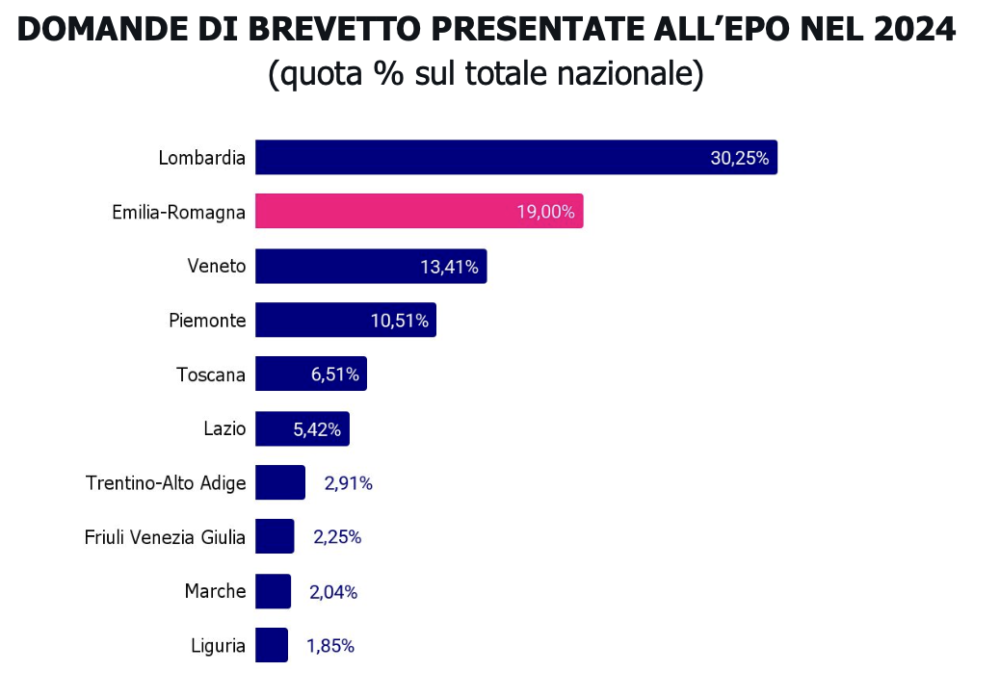
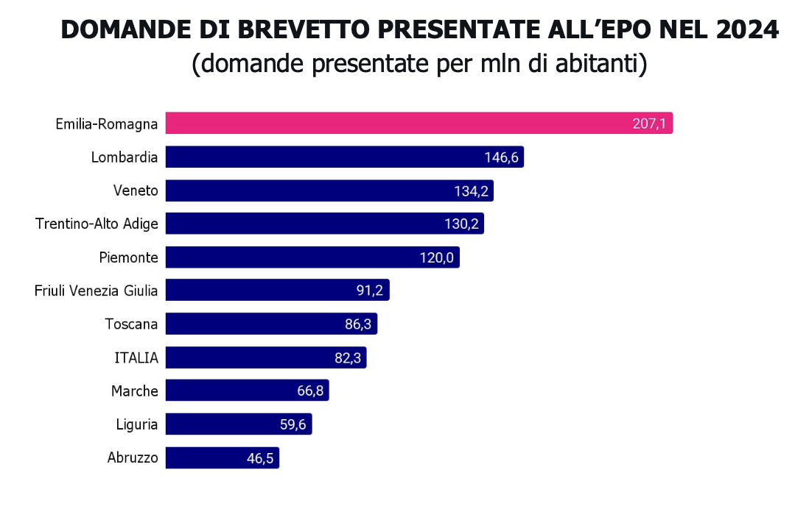
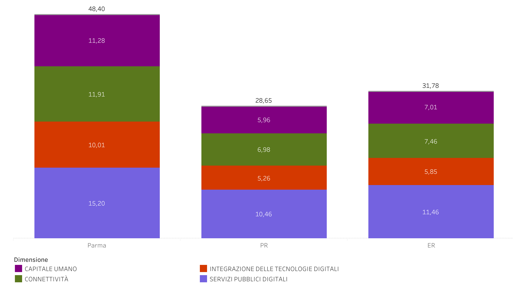

```{r}
# Packgs and functions ----
library(here)
library(fs)
library(readxl)
library(janitor)
library(skimr)
library(glue)

library(dplyr)
library(tidyr)
library(forcats)
library(stringr)
library(purrr)
library(flextable)
library(sf)
library(ggplot2)
library(ggiraph)
library(camcorder)
library(patchwork) # for combining ggplots
# p1 + p2                    # Affiancati
# p1 / p2                    # Uno sopra l'altro
# p1 | p2                    # Affiancati (equivalente a +)
# (p1 + p2) / p3             # Layout complesso
# p1 + p2 + plot_layout(ncol = 2)  # Specificare colonne

# Colors ----
grey_extra_sc <- "#4F4F4F"
grey_sc <- "#808080"
grey_md1 <- "#A9A9A9"
grey_md2 <- "#D3D3D3"
grey_extrlight <- "#FDFBF7"
burg_sc <- "#5C2129"
burg_md <- "#873C4A"
burg_lg <- "#B85E6A"
blu_sc <- "#033c55"
blu_md <- "#005d82"
blu_lg <- "#5582a7"
grn_sc <- "#246864"
grn_md <- "#539d90"
grn_lg <- "#8eb9b1"
ylw_sc <- "#b27d2c"
ylw_md <- "#d9a44a"
ylw_lg <- "#f0c166"

maschi <- "#6B8FAD"
femmine <- "#C47A87"

grave <- "#834ba0"
moderata <- "#ce78b3"

```


```{r}
# ------- R utilities and functions
#source(file = here("R","f_recap_values.R")) # # f_recap_values(df, c("col1","col2"))
#source(file = here("R","f_ggplot2.R")) # custom ggplot2 theme
source(file = here("R", "f_ft_formatting.R")) # %>% f_ft_properties()
```

# Importazione dati principali

+ **Shapefile x mappe**  
[@istatConfiniUnitaAmministrative2025a]
```{r}
#| label: import_shapefiles

# Import comuni PARMA shapefile (istat, 2025) - Parma ----
ER_PR_comuni_sf <- readRDS(here("data_in", "ER_shp", "ER_PR_comuni_sf.rds")) |>
  select(PRO_COM_T, COMUNE, Shape_Leng, Shape_Area, geometry)
# Importa tabella LINK x assegnare COMUNI A DISTRETTI ----
comuni_distretti_parma <- read_excel(here(
  "data_in",
  "ER_shp",
  "comuni_distretti_parma.xlsx"
))

```

+ **Dati popolazione residente 2025**  
I dati sulla popolazione residente vengono da 2 fonti: Istat [[@istatDemoDemografiaCifre2025]] e RE-R Statistica [@re-rstatisticaPopolazioneResidenteSesso2024].

```{r}
#| label: import_pop_resid_2025

# Import dati popolazione residente x sesso/eta in province RER ----
# ----- Puliti in `data_in/RER_statistica/convert_RER_2tidy.R` (A)
resident_prov_eta5_sex <- readRDS(here(
  "data_in",
  "pop_resid_2025",
  "RER_statistica",
  "resident_prov_eta5_sex.rds"
)) |>
  rename(territorio = provincia) |>
  mutate(genere = factor(genere, levels = c("Maschi", "Femmine", "Totale")))

# Import dati stranieri PR ----
# Puliti in `data_in/istat_demo_stran_2025/convert_istat_pop_2tidy.R` (B)
resid_stran_eta5_sex_PR <- readRDS(here(
  "data_in",
  "pop_resid_2025",
  "istat_demo_stran_2025",
  "resid_stran_eta5_sex_PR.rds"
)) |>
  mutate(genere = factor(genere, levels = c("Maschi", "Femmine", "Totale")))

# Import dati stranieri ER ----
# Puliti in `data_in/istat_demo_stran_2025/convert_istat_pop_2tidy.R` (B)
resid_stran_eta5_sex_ER <- readRDS(
  here("data_in", "pop_resid_2025", "istat_demo_stran_2025", "resid_stran_eta5_sex_ER.rds")
)

# Import dati pop residente x sesso/eta in distretti ER ----
resident_distr_eta_sex <- readRDS(here(
  "data_in",
  "pop_resid_2025",
  "RER_statistica",
  "resident_distr_eta_sex.rds"
))
```

+ **Dati TREND demografici ISTAT 2002-2024**  
[@istatDemoDemografiaCifre2025]

```{r}
#| label: import_istat_trend_demo

# --- Load dataset ISTAT TREND DEMOGRAFICI ----
indicatori_di_struttura <- readRDS(here(
  "data_in",
  "istat_demo_2002_2024",
  "indicatori_di_struttura.rds"
))
#speranza_di_vita_65 <- readRDS(here("data_in", "istat_demo_2002_2024", "speranza_di_vita_65.rds"))
crescita_naturale <- readRDS(here(
  "data_in",
  "istat_demo_2002_2024",
  "crescita_naturale.rds"
))
saldo_migratorio <- readRDS(here(
  "data_in",
  "istat_demo_2002_2024",
  "saldo_migratorio_totale.rds"
))

# Esplora indicatori disponibili
# tabyl(indicatori_di_struttura$indicatore)
```

+ **Dati fragilità demografica RE-R Statistica**  
[@re-rstatisticaPotenzialeFragilitaDemografica2025]
```{r}
#| label: fonti_bil_miss

# Import dati fragilità demografica ----
# % Popolazione residente di 65 anni e oltre in famiglie unipersonali al 31.12.2023
fragil_raw <- read_excel(
  "data_in/fragil/Dati-Fragilita-2023-Indicatori-elementari-comunali-e-provinciali.xlsx",
  skip = 1
)
```


+ **Dati ISTAT BES (Benessere Equo e Sostenibile)**  
[@istatBesTerritoriEmilia2025a]

<!-- 
## Dati di input (ISTAT BES)
+ Ultimo Report regionali BesT  https://www.istat.it/wp-content/uploads/2025/12/BesT2025_Emilia-Romagna.pdf
+ Riscaricato in formato molto piu facile da gestire read_excel("data_in/bes_2003_2023/Indicatori_per_provincia_sesso_ed.2025.xlsx" )
-->

```{r}
# Directories ----
bes_data_in <- here::here("data_in", "bes_2003_2023")
bes_data_out <- here::here("data_out", "bes_2003_2023")
# Import full BES dataset per provincia e sesso ----
all_bes <- read_excel(
  here(
    "data_in",
    "bes_2003_2023",
    "Indicatori_per_provincia_sesso_ed.2025.xlsx"
  ),
  sheet = "Indicatori_per_provincia_sesso"
) |>
  janitor::clean_names()
```

+ **Dati Ehis Anziani non autosufficienti**  
[@istatEhisAnzianiNonAutosufficienti2025a]

```{r}
# Corrisponde a EHIS_limit_tavola3_2_3 pulito e salvato
# ----- "Persone di 65+ anni con difficoltà nelle attività di **cura della persona**, regione e ripartizione geografica"

ADL_reg <- readRDS(here::here(
  "data_in",
  "istat_EHIS_2019",
  "ADL_reg_perc_clean.rds"
))
```

# 1° PRIORITÀ: Ridurre le disuguaglianze 

> "La Fondazione si pone l'obiettivo strategico di affrontare dinamiche che influenzano le disparità e le distanze tra persone." [DPP 2025]"

Quali sono le **dinamiche demografiche in atto** che influenzano le disuguaglianze e le distanze tra persone?

## Popolazione residente

<!-- Dati provenienti da:
+ Istat, popolazione straniera (aggiornati al 01/01/2025), e da 
+ Regione Emilia-Romagna - Statistica, aggiornati al 03/06/2025.  
-->

```{r}
#| label: pop_prov_data

# tabyl(resident_prov_eta5_sex$genere)
# tabyl(resident_prov_eta5_sex$fascia_eta)

# popolazione residente Parma 2025
pop_parma_2025 <- resident_prov_eta5_sex |>
  dplyr::filter(
    territorio == "Parma" & genere == "Totale" & fascia_eta == "Tutte_eta"
  ) |>
  dplyr::pull(residenti)

# popolazione residente ER 2025
pop_ER_2025 <- resident_prov_eta5_sex |>
  dplyr::filter(
    territorio == "Emilia-Romagna" &
      genere == "Totale" &
      fascia_eta == "Tutte_eta"
  ) |>
  dplyr::pull(residenti)
```

#### OVER 65+ in % di Tutte_eta
```{r}
# over 65 + in % of Tutte_eta
# 65-69 30    0.05
# 70-74 30    0.05
# 75-79 30    0.05
# 80-84 30    0.05
# 85-89 30    0.05
# 90 e oltre 30    0.05
tabyl(resident_prov_eta5_sex$fascia_eta)

over65_fasce <- c("65-69", "70-74", "75-79", "80-84", "85-89", "90 e oltre")

perc_over65 <- resident_prov_eta5_sex |>
  dplyr::filter(territorio %in% c("Parma", "Emilia-Romagna") & genere == "Totale") |>
  dplyr::summarise(
    pop_over65 = sum(residenti[fascia_eta %in% over65_fasce]),
    pop_totale = sum(residenti[fascia_eta == "Tutte_eta"]),
    .by = territorio
  ) |>
  dplyr::mutate(perc_over65 = pop_over65 / pop_totale * 100)

perc_over65_PR <- perc_over65 |> dplyr::filter(territorio == "Parma") |> dplyr::pull(perc_over65)
perc_over65_ER <- perc_over65 |> dplyr::filter(territorio == "Emilia-Romagna") |> dplyr::pull(perc_over65)
# Fonte: Istat, Demografia in cifre (01/01/2025) — dato nazionale non presente in dataset RER
perc_over65_IT <- 24.0
```

```{r}
#| label: resid_stran_parma

# tabyl(resid_stran_eta5_sex_PR$genere)
# tabyl(resid_stran_eta5_sex_PR$fascia_eta)

# popolazione straniera residente Parma 2025
pop_stran_parma_2025 <- resid_stran_eta5_sex_PR |>
  dplyr::filter(territorio == "Parma" & genere == "Totale") |>
  # non c'è la fascia "Tutte_eta" perciò sommo tutte le età
  dplyr::summarise(
    totale_residenti_stranieri = sum(residenti)
  ) |>
  dplyr::pull(totale_residenti_stranieri)
```


```{r}
#| label: resid_stran_ER

# tabyl(resid_stran_eta5_sex_ER$genere)
# tabyl(resid_stran_eta5_sex_ER$fascia_eta)

# popolazione straniera residente Parma 2025
pop_stran_ER_2025 <- resid_stran_eta5_sex_ER |>
  dplyr::filter(territorio == "Emilia-Romagna" & genere == "Totale") |>
  dplyr::summarise(
    totale_residenti_stranieri = sum(residenti)
  ) |>
  dplyr::pull(totale_residenti_stranieri)
```

La popolazione residente nella provincia di Parma nel 2025 (ultimo aggiornamento: 03/06/2025) è di `r scales::label_number(big.mark = ".", decimal.mark = ",")(pop_parma_2025)` abitanti. Il territorio accoglie una percentuale di residenti stranieri più alta della media regionale, al cui interno, la distribuzione per età mostra una concentrazione in fasce più giovani.

### [Tbl] Popolazione residente (con % straniera)

```{r}
#| label: tbl_pop_parma_ER_2025
#| output: true

# Tabella popolazione residente Parma ed ER 2025 ( con distinzione straniera )----
tbl_pop_parma_ER_2025 <- tibble(
  Territorio = c("Parma", "Emilia-Romagna"),
  pop_residente_2025 = c(pop_parma_2025, pop_ER_2025),
  pop_stran_residente_2025 = c(pop_stran_parma_2025, pop_stran_ER_2025)
) |>
  mutate(
    Perc_stranieri = round(
      pop_stran_residente_2025 / pop_residente_2025 * 100,
      2
    )
  ) |>
  flextable() |>
  colformat_double(
    j = c("pop_residente_2025", "pop_stran_residente_2025"),
    big.mark = ".",
    decimal.mark = ",",
    digits = 0,
    na_str = "N.D."
  ) |>
  # Formattazione percentuale
  colformat_double(
    j = "Perc_stranieri",
    big.mark = ".",
    decimal.mark = ",",
    digits = 2,
    suffix = " %",
    na_str = "N.D."
  ) |>
  # Headers
  set_header_labels(
    Territorio = "Territorio",
    pop_residente_2025 = "Popolazione residente (2025)",
    pop_stran_residente_2025 = "Popolazione straniera residente (2025)",
    Perc_stranieri = "% popolazione straniera sul totale (2025)"
  ) |>
  add_header_lines(
    values = "Popolazione residente e straniera a Parma ed Emilia-Romagna (2025)",
    top = TRUE
  ) |>
  bold(part = "header", i = 1) |>
  fontsize(size = 14, part = "header", i = 1) |>
  align(align = "center", part = "header", i = 1) |>
  add_footer_lines(
    "Fonte: Regione Emilia-Romagna - Statistica e Istat - Demografia in cifre, 2025"
  ) |>
  fontsize(size = 9, part = "footer") |>
  italic(part = "footer") |>
  color(color = grey_sc, part = "footer") |>
  # add background to italia and Parma
  bg(i = ~ Territorio %in% c("Parma"), bg = ylw_lg, part = "body") |>
  f_ft_word()

tbl_pop_parma_ER_2025
```


```{r}
# save as Rds
saveRDS(
  object = tbl_pop_parma_ER_2025,
  file = here("data_out", "pop_resid_2025", "tbl_pop_parma_ER_2025.rds")
)

# save as word docx
flextable::save_as_docx(
  tbl_pop_parma_ER_2025,
  path = here("data_out", "pop_resid_2025", "tbl_pop_parma_ER_2025.docx")
)
```


### Piramide d'età
```{r}
#| label: plot_parma_piramid
#| output: false

# Data
piramid_pop_PR_data <- resident_prov_eta5_sex |>
  # filter
  dplyr::filter(
    territorio == "Parma" &
      fascia_eta != "Tutte_eta" &
      genere %in% c("Maschi", "Femmine")
  ) |>
  dplyr::mutate(
    fascia_eta = stringr::str_replace(fascia_eta, "^(\\d)-(\\d)$", "0\\1-0\\2"),
    fascia_eta = stringr::str_replace(
      fascia_eta,
      "^(\\d)-(\\d{2})$",
      "0\\1-\\2"
    )
  )

# ------- Save data  objects
# as RDS
saveRDS(
  object = piramid_pop_PR_data,
  file = here("data_out", "pop_resid_2025", "piramid_pop_PR_data.rds")
)
# as XLSX
writexl::write_xlsx(
  x = piramid_pop_PR_data,
  path = here("data_out", "pop_resid_2025", "piramid_pop_PR_data.xlsx")
)


# Plot piramide età Parma 2025 ----

# Calculate nice limit automatically
max_pop <- max(abs(piramid_pop_PR_data$residenti))
nice_limit <- ceiling(max_pop / 1000) * 1000 # Round up to nearest 1000

piramid_pop_PR <- piramid_pop_PR_data |>
  ggplot(aes(
    x = fascia_eta,
    y = residenti,
    fill = genere
  )) +
  geom_bar(
    data = \(df) df |> filter(genere == "Maschi"),
    aes(y = -residenti),
    stat = "identity"
  ) +
  geom_bar(
    data = \(df) df |> filter(genere == "Femmine"),
    aes(y = residenti),
    stat = "identity"
  ) +
  coord_flip() +
  scale_y_continuous(
    labels = \(x) {
      scales::label_number(big.mark = ".", decimal.mark = ",")(abs(x))
    },
    breaks = seq(-nice_limit, nice_limit, by = nice_limit / 4),
    limits = c(-nice_limit, nice_limit),
    expand = expansion(mult = 0.025)
  ) +
  scale_fill_manual(
    values = c("Maschi" = maschi, "Femmine" = femmine)
  ) +
  theme_minimal(base_size = 13) +
  theme(
    panel.grid.major = element_line(color = "grey90", linewidth = rel(0.3)),
    panel.grid.minor = element_blank(),
    axis.text.x = element_text(size = rel(0.85), angle = 45),
    axis.text.y = element_text(size = rel(0.85)),
    axis.title = element_text(size = rel(1), face = "bold"),
    plot.title = element_text(
      size = rel(1.3),
      face = "bold",
      margin = margin(b = 10)
    ),
    plot.subtitle = element_text(
      size = rel(0.95),
      lineheight = 1.2,
      margin = margin(b = 10)
    ),
    strip.text = element_text(size = rel(1.1), face = "bold"),
    legend.text = element_text(size = rel(0.9)),
    legend.title = element_blank(),
    legend.position = "bottom",
    panel.spacing = unit(1, "lines")
  ) +
  labs(
    # title = "Popolazione residente a Parma (2025)",
    # subtitle = "Valori assoluti per sesso fasce d'età quinquennali",
    # caption = "Fonte: Regione Emilia-Romagna - Statistica",
    x = "",
    y = "",
    fill = "Sesso"
  )

# Stampa il grafico e salva manualmente
piramid_pop_PR
```

```{r}
#| label: plot_parma_str_piramid
#| output: false

# Plot piramide età stranieri Parma 2025 ----

piramid_pop_stran_PR_data <- resid_stran_eta5_sex_PR |>
  dplyr::filter(territorio == "Parma" & genere %in% c("Maschi", "Femmine")) |>
  dplyr::mutate(
    fascia_eta = stringr::str_replace(fascia_eta, "^(\\d)-(\\d)$", "0\\1-0\\2"),
    fascia_eta = stringr::str_replace(
      fascia_eta,
      "^(\\d)-(\\d{2})$",
      "0\\1-\\2"
    )
  )

# ------- Save data and plot objects
# as RDS
saveRDS(
  object = piramid_pop_stran_PR_data,
  file = here("data_out", "pop_resid_2025", "piramid_pop_stran_PR_data.rds")
)
# as XLSX
writexl::write_xlsx(
  x = piramid_pop_stran_PR_data,
  path = here("data_out", "pop_resid_2025", "piramid_pop_stran_PR_data.xlsx")
)


# Calculate nice limit automatically
max_stran <- max(abs(piramid_pop_stran_PR_data$residenti))
nice_limit_stran <- ceiling(max_stran / 100) * 100 # Round up to nearest 100

piramid_pop_stran_PR <- piramid_pop_stran_PR_data |>
  ggplot(aes(
    x = fascia_eta,
    y = residenti,
    fill = genere
  )) +
  geom_bar(
    data = \(df) df |> filter(genere == "Maschi"),
    aes(y = -residenti),
    stat = "identity"
  ) +
  geom_bar(
    data = \(df) df |> filter(genere == "Femmine"),
    aes(y = residenti),
    stat = "identity"
  ) +
  coord_flip() +
  scale_y_continuous(
    labels = \(x) {
      scales::label_number(big.mark = ".", decimal.mark = ",")(abs(x))
    },
    breaks = seq(
      -nice_limit_stran,
      nice_limit_stran,
      by = nice_limit_stran / 4
    ),
    limits = c(-nice_limit_stran, nice_limit_stran),
    expand = expansion(mult = 0.025)
  ) +
  scale_fill_manual(
    values = c("Maschi" = maschi, "Femmine" = femmine)
  ) +
  theme_minimal(base_size = 13) +
  theme(
    panel.grid.major = element_line(color = "grey90", linewidth = rel(0.3)),
    panel.grid.minor = element_blank(),
    axis.text.x = element_text(size = rel(0.85), angle = 45),
    axis.text.y = element_text(size = rel(0.85)),
    axis.title = element_text(size = rel(1), face = "bold"),
    plot.title = element_text(
      size = rel(1.3),
      face = "bold",
      margin = margin(b = 10)
    ),
    plot.subtitle = element_text(
      size = rel(0.95),
      lineheight = 1.2,
      margin = margin(b = 10)
    ),
    strip.text = element_text(size = rel(1.1), face = "bold"),
    legend.text = element_text(size = rel(0.9)),
    legend.title = element_blank(),
    legend.position = "bottom",
    panel.spacing = unit(1, "lines")
  ) +
  labs(
    # title = "Popolazione STRANIERA residente a Parma (2025)",
    # subtitle = "Valori assoluti per sesso fasce d'età quinquennali",
    # caption = "Fonte: IStat, Demografia in cifre",
    x = "",
    y = "",
    fill = "Sesso"
  )


# Stampa il grafico e salva manualmente
piramid_pop_stran_PR

```

```{r}
#| output: true

library(patchwork)
# Combine plots
piramids_PR_both <- piramid_pop_PR +
  piramid_pop_stran_PR +
  plot_layout(guides = "collect") + # This collects and merges legends
  plot_annotation(
    title = "Piramidi d'età della popolazione residente a Parma (2025)",
    subtitle = "Confronto tra popolazione totale e straniera (scale diverse)",
    caption = "Fonte: Regione Emilia-Romagna - Statistica e Istat - Demografia in cifre"
  )

piramids_PR_both <- patchwork:::`&.gg`(
  piramids_PR_both,
  theme(
    plot.title = element_text(size = rel(1.4), face = "bold"),
    plot.subtitle = element_text(size = rel(1.1)),
    plot.caption = element_text(
      size = rel(0.9),
      face = "italic",
      color = grey_sc
    ),
    legend.position = "bottom"
  )
)

piramids_PR_both

# Save combined plot (manually)

```

## Popolazione per 4 distretti

La popolazione residente nella provincia di Parma è suddivisa in 4 distretti sanitari, e si concentra principalmente nel distretto di Parma città, che include il capoluogo e i comuni limitrofi.  

```{r}
#| label: map_distretti_prep

# # 1) Importa tabella link distretti-comuni
# comuni_distretti_parma <- read_excel(here("data_in", "ER_shp", "comuni_distretti_parma.xlsx"))
#
# # 2) Import comuni PARMA shapefile (istat, 2025) - Parma ----
# ER_PR_comuni_sf <- readRDS(here("data_in", "ER_shp", "ER_PR_comuni_sf.rds")) |>
#   select(PRO_COM_T, COMUNE, Shape_Leng, Shape_Area, geometry)

# 3) Associa distretto a ogni comune di  Parma ----
ER_PR_comuni_distr_sf <- ER_PR_comuni_sf |>
  left_join(comuni_distretti_parma, by = c("COMUNE" = "Comune")) |>
  select(PRO_COM_T, COMUNE, Distretto, Shape_Leng, Shape_Area, geometry)

skim(ER_PR_comuni_distr_sf)
str(ER_PR_comuni_distr_sf)
unique(ER_PR_comuni_distr_sf$Distretto)

# 4) Make sf union per distretto ----
ER_PR_distretti_sf <- ER_PR_comuni_distr_sf %>%
  group_by(Distretto) %>%
  summarise(
    n_comuni = n(),
    comuni = paste(COMUNE, collapse = ", "),
    geometry = st_union(geometry),
    .groups = "drop"
  )
```


```{r}
#| label: resid_distretti_parma_data

resident_distr_eta_sex <- resident_distr_eta_sex |>
  # Separa una colonna con la provincia
  dplyr::rename(distretto_prov = provincia) |>
  dplyr::mutate(
    distretto = str_remove(distretto_prov, "\\s*\\(AUSL.*\\)$") |> str_trim(),
    ausl = str_extract(distretto_prov, "(?<=\\().*(?=\\))"),
    prov = str_extract(distretto_prov, "(?<=AUSL\\s)[A-Z]+")
  ) |>
  dplyr::mutate(
    provincia = case_when(
      prov == "PR" ~ "Parma",
      prov == "RE" ~ "Reggio nell'Emilia",
      prov == "MO" ~ "Modena",
      prov == "PC" ~ "Piacenza",
      prov == "BO" ~ "Bologna",
      prov == "I" ~ "Bologna",
      prov == "FE" ~ "Ferrara",
      prov == "R" & str_detect(distretto_prov, "Forlì") ~ "Forlì-Cesena",
      prov == "R" & str_detect(distretto_prov, "Cesena") ~ "Forlì-Cesena",
      prov == "R" & str_detect(distretto_prov, "Rubicone") ~ "Forlì-Cesena",
      prov == "R" & str_detect(distretto_prov, "Rimini") ~ "Rimini",
      prov == "R" & str_detect(distretto_prov, "Riccione") ~ "Rimini",

      prov == "R" & str_detect(distretto_prov, "Ravenna") ~ "Ravenna",
      prov == "R" & str_detect(distretto_prov, "Faenza") ~ "Ravenna",
      prov == "R" & str_detect(distretto_prov, "Lugo") ~ "Ravenna",
      TRUE ~ NA_character_
    )
  ) |>
  # filtra dati popolazione per distretti Parma ----
  dplyr::filter(prov == "PR")

names(resident_distr_eta_sex)
names(ER_PR_distretti_sf)
tabyl(resident_distr_eta_sex$fascia_eta)
tabyl(resident_distr_eta_sex$distretto)
tabyl(resident_distr_eta_sex$distretto_prov)

# Aggiungi geometria manualmente ----
resident_distr_eta_sex_sf <- resident_distr_eta_sex |>
  left_join(
    ER_PR_distretti_sf |> st_drop_geometry(),
    by = c("distretto_prov" = "Distretto")
  ) |>
  left_join(
    ER_PR_distretti_sf |> select(Distretto, geometry),
    by = c("distretto_prov" = "Distretto")
  ) |>
  st_as_sf()

# # 2) Split into separate datasets per sesso / eta ----
# distr_eta_tutti <- resident_distr_eta_sex |>
#   dplyr::filter(fascia_eta == "Tutte_eta" & genere == "Totale")
#
# distr_eta_0_13 <- resident_distr_eta_sex |>
#   dplyr::filter(fascia_eta == "0-13" & genere == "Totale")
#
# distr_eta_14_59 <- resident_distr_eta_sex |>
#   dplyr::filter(fascia_eta == "14-59" & genere == "Totale")
#
# distr_eta_60_plus <- resident_distr_eta_sex |>
#   dplyr::filter(fascia_eta == "60  e oltre" & genere == "Totale")
#
# # 3) Associa geometria distretti a dati popolazione per distretti Parma ----
# distr_eta_tutti_sf <- ER_PR_distretti_sf |>
#   full_join(
#     distr_eta_tutti,
#     by = c("Distretto" = "distretto_prov")
#   )
#
# distr_eta_0_13_sf <- ER_PR_distretti_sf |>
#   left_join(
#     distr_eta_0_13,
#     by = c("Distretto" = "distretto_prov")
#   )
#
#
# distr_eta_14_59_sf <- ER_PR_distretti_sf |>
#   left_join(
#     distr_eta_14_59,
#     by = c("Distretto" = "distretto_prov")
#   )
#
# distr_eta_60_plus_sf <- ER_PR_distretti_sf |>
#   left_join(
#     distr_eta_60_plus,
#     by = c("Distretto" = "distretto_prov")
#   )

# Save joined data
saveRDS(
  object = resident_distr_eta_sex_sf,
  file = here("data_out", "pop_resid_2025", "resident_distr_eta_sex_sf.rds")
)
# as XLSX
writexl::write_xlsx(
  x = resident_distr_eta_sex_sf,
  path = here("data_out", "pop_resid_2025", "resident_distr_eta_sex_sf.xlsx")
)
# as shapefile
fs::dir_create(here(
  "data_out",
  "pop_resid_2025",
  "resident_distr_eta_sex_sf_shp"
))

sf::write_sf(
  resident_distr_eta_sex_sf,
  here(
    "data_out",
    "pop_resid_2025",
    "resident_distr_eta_sex_sf_shp",
    "resident_distr_eta_sex_sf.shp"
  )
)
```

### [Tbl] Popolazione residente per distretti di Parma

```{r}
#| label: tbl_pop_distr_2025
#| output: true

# Tabella popolazione residente Parma ed ER 2025 ( con distinzione straniera )----
tbl_pop_distr_2025 <- resident_distr_eta_sex |>
  dplyr::filter(fascia_eta == "Tutte_eta" & genere == "Totale") |>
  select(provincia, distretto_prov, residenti) |>
  flextable() |>
  # Headers
  set_header_labels(
    provincia = "Provincia",
    distretto_prov = "Distretto",
    residenti = "Popolazione residente"
  ) |>
  add_header_lines(
    values = "Popolazione residente per distretto sanitario (2025)",
    top = TRUE
  ) |>
  bold(part = "header", i = 1) |>
  fontsize(size = 14, part = "header", i = 1) |>
  align(align = "center", part = "header", i = 1) |>
  add_footer_lines("Fonte: Regione Emilia-Romagna - Statistica, 2025") |>
  fontsize(size = 9, part = "footer") |>
  italic(part = "footer") |>
  color(color = grey_sc, part = "footer")

tbl_pop_distr_2025

# save as Rds
saveRDS(
  object = tbl_pop_distr_2025,
  file = here("data_out", "pop_resid_2025", "tbl_pop_distr_2025.rds")
)
# save as word docx
flextable::save_as_docx(
  tbl_pop_distr_2025,
  path = here("data_out", "pop_resid_2025", "tbl_pop_distr_2025.docx")
)
```

### Mappa popolazione residente per distretto

I distretti _Sud Est_ e _Valli Taro e Ceno_ sono i meno popolati e presentano il potenziale maggiore di fragilità sociale, oltre che demografica (percentuale di residenti anziani e soli, difficoltà di radicamento della popolazione straniera, opportunità di istruzione) -- Cfr. **RE-R Statistica**, 2025, [_"La potenziale fragilità demografica, sociale ed economica nei comuni della regione Emilia Romagna. Anno 2023"_](https://statistica.regione.emilia-romagna.it/studi-analisi/pubblicazioni-ricerche/rapporto-mappe-potenziale-fragilita-emilia-romagna-2023). 

```{r}
#| label: map_distretti_parma_pop
#| output: true
#| fig-cap: ""
#| out-width: 100%

# Arguments
fonte_anno_agg <- "Istat/SITUAS (2025)"
fonte_nome <- "Confini dei Comuni"

fonte2_anno_agg <- "RE-R Statistica (2025)"
fonte2_nome <- "Popolazione residente"

# Plot mappa distretti Parma con popolazione residente 2025 ----
map_distretti_parma_pop <- resident_distr_eta_sex_sf |>
  filter(genere == "Totale" & fascia_eta == "Tutte_eta") |>
  ggplot() +
  geom_sf(aes(fill = residenti), color = "white", linewidth = rel(0.2)) +
  geom_sf_label(
    aes(label = str_wrap(distretto, width = 20)),
    size = 3,
    alpha = 0.7
  ) + # Etichette con sfondo
  scale_fill_viridis_c(
    option = "cividis",
    begin = 0.5,
    end = 0.9,
    direction = -1,
    na.value = "grey90",
    name = "N. residenti",
    labels = scales::label_number(big.mark = ".", decimal.mark = ",")
  ) +
  labs(
    title = "Popolazione residente per distretto sanitario",
    subtitle = "(Confini = unione di comuni di pertinenza)",
    caption = glue::glue(
      "Fonte: {fonte_anno_agg} — {fonte_nome}; \n{fonte2_anno_agg} — {fonte2_nome}"
    ),
    x = "",
    y = ""
  ) +
  theme_minimal() +
  theme(
    legend.position = "right",
    plot.title = element_text(face = "bold", size = 12),
    plot.subtitle = element_text(size = 10),
    # Rimuove assi coordinati e griglia per mappa più pulita
    axis.text = element_blank(),
    axis.ticks = element_blank(),
    panel.grid = element_blank()
  )

map_distretti_parma_pop
```

```{r}
#| label: map_distretti_parma_pop_anz
#| output: false
#| fig-cap: ""
#| out-width: 100%

# Arguments
fonte_anno_agg <- "Istat/SITUAS (2025)"
fonte_nome <- "Confini dei Comuni"

fonte2_anno_agg <- "RE-R Statistica (2025)"
fonte2_nome <- "Popolazione residente"


# Plot mappa distretti Parma con popolazione residente 2025 ----
map_distretti_parma_pop_anz <- resident_distr_eta_sex_sf |>
  filter(genere == "Totale" & fascia_eta == "60  e oltre") |>
  ggplot() +
  geom_sf(aes(fill = residenti), color = "white", linewidth = rel(0.2)) +
  geom_sf_label(
    aes(label = str_wrap(distretto, width = 20)),
    size = 3,
    alpha = 0.7
  ) + # Etichette con sfondo
  scale_fill_viridis_c(
    option = "rocket",
    direction = -1,
    na.value = "grey90",
    name = "N. residenti 60+",
    labels = scales::label_number(big.mark = ".", decimal.mark = ",")
  ) +
  labs(
    title = "Popolazione residente per distretto sanitario (60 anni e oltre)",
    subtitle = "(Confini = unione di comuni di pertinenza)",
    caption = glue::glue(
      "Fonte: {fonte_anno_agg} — {fonte_nome}; \n{fonte2_anno_agg} — {fonte2_nome}"
    ),
    x = "",
    y = ""
  ) +
  theme_minimal() +
  theme(
    legend.position = "right",
    plot.title = element_text(face = "bold", size = 12),
    plot.subtitle = element_text(size = 10),
    # Rimuove assi coordinati e griglia per mappa più pulita
    axis.text = element_blank(),
    axis.ticks = element_blank(),
    panel.grid = element_blank()
  )

map_distretti_parma_pop_anz
```

```{r}
#| label: map_distretti_parma_pop_anz_per
#| output: false
#| fig-cap: ""
#| out-width: 100%

# Arguments
fonte_anno_agg <- "Istat/SITUAS (2025)"
fonte_nome <- "Confini dei Comuni"

fonte2_anno_agg <- "RE-R Statistica (2025)"
fonte2_nome <- "Popolazione residente"

# Plot mappa distretti Parma con popolazione residente 2025 ----
map_distretti_parma_pop_anz_per <- resident_distr_eta_sex_sf |>
  filter(genere == "Totale" & fascia_eta %in% c("60  e oltre", "Tutte_eta")) |>
  group_by(distretto) |>
  summarise(
    total_residenti = sum(if_else(fascia_eta == "Tutte_eta", residenti, 0)),
    residenti_60_plus = sum(if_else(fascia_eta == "60  e oltre", residenti, 0)),
    perc_60_plus = residenti_60_plus / total_residenti * 100,
    .groups = "drop"
  ) |>
  ggplot() +
  geom_sf(aes(fill = perc_60_plus), color = "white", linewidth = rel(0.2)) +
  geom_sf_label(
    aes(label = str_wrap(distretto, width = 20)),
    size = 3,
    alpha = 0.7
  ) + # Etichette con sfondo
  scale_fill_viridis_c(
    option = "cividis",
    begin = 0.5,
    end = 0.9,
    direction = -1,
    na.value = "grey90",
    name = "% residenti >60",
    breaks = seq(0, 40, by = 5),
    labels = scales::label_number(suffix = "%", decimal.mark = ",")
  ) +
  labs(
    title = "Popolazione residente per distretto sanitario (60 anni e oltre in %)",
    subtitle = "(Confini = unione di comuni di pertinenza)",
    caption = glue::glue(
      "Fonte: {fonte_anno_agg} — {fonte_nome}; \n{fonte2_anno_agg} — {fonte2_nome}"
    ),
    x = "",
    y = ""
  ) +
  theme_minimal() +
  theme(
    legend.position = "right",
    plot.title = element_text(face = "bold", size = 12),
    plot.subtitle = element_text(size = 10),
    # Rimuove assi coordinati e griglia per mappa più pulita
    axis.text = element_blank(),
    axis.ticks = element_blank(),
    panel.grid = element_blank()
  )

map_distretti_parma_pop_anz_per
```

```{r}
#| label: map_distretti_parma_pop_gio
#| output: false
#| fig-cap: ""
#| out-width: 100%

# Arguments
fonte_anno_agg <- "Istat/SITUAS (2025)"
fonte_nome <- "Confini dei Comuni"

fonte2_anno_agg <- "RE-R Statistica (2025)"
fonte2_nome <- "Popolazione residente"


# Plot mappa distretti Parma con popolazione residente 2025 ----
map_distretti_parma_pop_gio <- resident_distr_eta_sex_sf |>
  filter(genere == "Totale" & fascia_eta == "0-13") |>
  ggplot() +
  geom_sf(aes(fill = residenti), color = "white", linewidth = rel(0.2)) +
  geom_sf_label(
    aes(label = str_wrap(distretto, width = 20)),
    size = 3,
    alpha = 0.7
  ) + # Etichette con sfondo
  scale_fill_viridis_c(
    option = "cividis",
    begin = 0.5,
    end = 0.9,
    direction = -1,
    na.value = "grey90",
    name = "N. residenti < 14",
    labels = scales::label_number(big.mark = ".", decimal.mark = ",")
  ) +
  labs(
    title = "Popolazione residente per distretto sanitario (0-13 anni)",
    subtitle = "(Confini = unione di comuni di pertinenza)",
    caption = glue::glue(
      "Fonte: {fonte_anno_agg} — {fonte_nome}; \n{fonte2_anno_agg} — {fonte2_nome}"
    ),
    x = "",
    y = ""
  ) +
  theme_minimal() +
  theme(
    legend.position = "right",
    plot.title = element_text(face = "bold", size = 12),
    plot.subtitle = element_text(size = 10),
    # Rimuove assi coordinati e griglia per mappa più pulita
    axis.text = element_blank(),
    axis.ticks = element_blank(),
    panel.grid = element_blank()
  )

map_distretti_parma_pop_gio
```

```{r}
#| label: map_distretti_parma_pop_gio_per
#| output: false
#| fig-cap: ""
#| out-width: 100%

# Arguments
fonte_anno_agg <- "Istat/SITUAS (2025)"
fonte_nome <- "Confini dei Comuni"

fonte2_anno_agg <- "RE-R Statistica (2025)"
fonte2_nome <- "Popolazione residente"

# Plot mappa distretti Parma con popolazione residente 2025 ----
map_distretti_parma_pop_gio_per <- resident_distr_eta_sex_sf |>
  filter(genere == "Totale" & fascia_eta %in% c("0-13", "Tutte_eta")) |>
  group_by(distretto) |>
  summarise(
    total_residenti = sum(if_else(fascia_eta == "Tutte_eta", residenti, 0)),
    residenti_0_13 = sum(if_else(fascia_eta == "0-13", residenti, 0)),
    perc_0_13 = residenti_0_13 / total_residenti * 100,
    .groups = "drop"
  ) |>
  ggplot() +
  geom_sf(aes(fill = perc_0_13), color = "white", linewidth = rel(0.2)) +
  geom_sf_label(
    aes(label = str_wrap(distretto, width = 20)),
    size = 3,
    alpha = 0.7
  ) + # Etichette con sfondo
  scale_fill_viridis_c(
    option = "cividis",
    begin = 0.5,
    end = 0.9,
    direction = -1,
    na.value = "grey90",
    name = "% residenti <14",
    breaks = seq(0, 20, by = 2),
    labels = scales::label_number(suffix = "%", decimal.mark = ",")
  ) +
  labs(
    title = "Popolazione residente per distretto sanitario (0-13 anni in %)",
    subtitle = "(Confini = unione di comuni di pertinenza)",
    caption = glue::glue(
      "Fonte: {fonte_anno_agg} — {fonte_nome}; \n{fonte2_anno_agg} — {fonte2_nome}"
    ),
    x = "",
    y = ""
  ) +
  theme_minimal() +
  theme(
    legend.position = "right",
    plot.title = element_text(face = "bold", size = 12),
    plot.subtitle = element_text(size = 10),
    # Rimuove assi coordinati e griglia per mappa più pulita
    axis.text = element_blank(),
    axis.ticks = element_blank(),
    panel.grid = element_blank()
  )

map_distretti_parma_pop_gio_per
```

### Mappa popolazione per distetto e fasce d'età (%)
```{r}
#| label: map_distretti_parma_pop_anz_gio_per_patch
#| output: true

# Combine plots
# Combine plots - remove titles/subtitles/captions from individual plots
map_distretti_parma_pop_anz_gio_per_patch <-
  (map_distretti_parma_pop_anz_per +
    labs(title = NULL, subtitle = NULL, caption = NULL)) +
  (map_distretti_parma_pop_gio_per +
    labs(title = NULL, subtitle = NULL, caption = NULL)) +
  plot_annotation(
    title = "Popolazione residente per distretto sanitario: età 0-13 e 60+ (in %)",
    subtitle = "(Confini = unione di comuni di pertinenza)",
    caption = "Fonte: Istat/SITUAS (2025) — Confini dei Comuni; RE-R Statistica (2025) — Popolazione residente"
  )

map_distretti_parma_pop_anz_gio_per_patch <- patchwork:::`&.gg`(
  map_distretti_parma_pop_anz_gio_per_patch,
  theme(
    plot.title = element_text(size = rel(1.4), face = "bold"),
    plot.subtitle = element_text(size = rel(1.1)),
    plot.caption = element_text(
      size = rel(0.9),
      face = "italic",
      color = grey_sc
    ),
    legend.position = "bottom"
  )
)

map_distretti_parma_pop_anz_gio_per_patch

# Save combined plot (manually)
```

### Mappa over 65 soli per comune

Uno degli indicatori "spia" di potenziale fragilità sociale è la `percentuale di popolazione residente di 65+ anni in familglie unipersonali` (**RE-R Statistica, 2025**, con dati al 31.12.2023).

```{r}
# # % Popolazione residente di 65 anni e oltre in famiglie unipersonali al 31.12.2023
#
# fragil_raw <- read_excel("data_in/fragil/Dati-Fragilita-2023-Indicatori-elementari-comunali-e-provinciali.xlsx", skip= 1)

names(fragil_raw)

over65_unip <- fragil_raw |>
  filter(den_prov == "Parma") |>
  select(cod_com, den_com, socind1)

# Join over65_unip with ER_PR_comuni_sf ----
over65_unip_sf <- ER_PR_comuni_sf |>
  left_join(
    over65_unip,
    by = c("PRO_COM_T" = "cod_com")
  ) |>
  st_as_sf()

# Save joined data
saveRDS(
  object = over65_unip_sf,
  file = here("data_out", "fragil", "over65_unip_sf.rds")
)
# as XLSX
writexl::write_xlsx(
  x = over65_unip_sf |> st_drop_geometry(),
  path = here("data_out", "fragil", "over65_unip_sf.xlsx")
)
# as shapefile
fs::dir_create(here("data_out", "fragil", "over65_unip_sf_shp"))
sf::write_sf(
  over65_unip_sf,
  here("data_out", "fragil", "over65_unip_sf_shp", "over65_unip_sf.shp")
)
```

```{r}
#| label: over65_unip_map
#| output: true
#| fig-cap: ""
#| out-width: 100%

# Plot mappa over65 unipersonali Parma 2023 ----
over65_unip_map <- over65_unip_sf |>
  ggplot() +
  geom_sf(aes(fill = socind1), color = "white", linewidth = rel(0.2)) +
  #geom_sf_label(aes(label = den_com), size = 2, alpha = 0.7) +  # Etichette con sfondo
  scale_fill_viridis_c(
    option = "cividis",
    begin = 0.5,
    end = 0.9,
    direction = -1,
    na.value = "grey90",
    name = "%. residenti soli 65+",
    labels = scales::label_number(big.mark = ".", decimal.mark = ",")
  ) +
  # Add layer for distretti borders
  geom_sf(
    data = ER_PR_distretti_sf,
    fill = NA,
    color = blu_sc,
    linewidth = rel(0.5)
  ) +
  # ADd labs
  labs(
    title = "Popolazione residente di 65 anni e oltre in famiglie unipersonali  (Anno 2023)",
    subtitle = "Indicatore in % per comune",
    caption = str_wrap(
      "Fonte: Regione Emilia-Romagna - La potenziale fragilità demografica, sociale ed economica nei comuni della regione Emilia-Romagna (2023)",
      width = 80
    ),
    x = "",
    y = ""
  ) +
  theme_minimal() +
  theme(
    legend.position = "right",
    plot.title = element_text(face = "bold", size = 12),
    plot.subtitle = element_text(size = 10),
    # Rimuove assi coordinati e griglia per mappa più pulita
    axis.text = element_blank(),
    axis.ticks = element_blank(),
    panel.grid = element_blank()
  )

over65_unip_map

# Save plot (manually)
```


### Persone over 65 non autosufficienti

Secondo l’indagine europea sulla salute (_EHIS_), attualmente in corso di aggiornamento, na quota significativa di popolazione anziana (65+) presenta difficoltà nelle attività di cura della persona ( _ADL, Activities of Daily Living_ ), sia essa moderata o grave.  

Nel 2023, gli anziani non autosufficienti con gravi limitazioni erano 358.594 in Emilia-Romagna e 4.027.488 in Italia (per la prima volta sopra 4 milioni). Purtroppo a fronte di tassi di copertura del bisogno di servizi socio-sanitari altamente insufficienti e variabili a livello regionale, al netto delle diverse allocazioni/modalità di erogazione delle risorse [@fostiSettoreLongTerm2025]. <!-- : di carattere domiciliare/ADI (30,6%), residenziale (7,6%), o semiresidenziale (0,6%).   -->

```{r}
#| label: adl_reg_data

# ------- Arguments for plot
TITLE <- "Popolazione anziana non autosufficiente "
SUBTIT <- "% di popolazione 65+ con difficoltà nelle attività di cura della persona (ADL)"
CAP <- "Fonte: ISTAT - EHIS (European Health Interview Survey) 2022, su dati 2019"

# ------- Prepare data
adl_reg_data <- ADL_reg |>
  dplyr::filter(territorio %in% c("Emilia-Romagna", "Italia")) |>
  tidyr::pivot_longer(
    cols = c(moderata, grave), # removed nessuna
    names_to = "difficolta",
    values_to = "percentuale"
  ) |>
  dplyr::mutate(
    difficolta = factor(
      difficolta,
      levels = c(
        #"nessuna",
        "moderata",
        "grave"
      ),
      labels = c(
        #"Nessuna",
        "Moderata",
        "Grave"
      )
    ),
    territorio = factor(territorio, levels = c("Italia", "Emilia-Romagna"))
  )

# ------- Save data objects
# as RDS
saveRDS(
  object = adl_reg_data,
  file = here("data_out", "istat_EHIS_2019", "adl_reg_data.rds")
)
# as XLSX
writexl::write_xlsx(
  x = adl_reg_data,
  path = here("data_out", "istat_EHIS_2019", "adl_reg_data.xlsx")
)
```


```{r}
#| label: adl_reg_plot
#| output: true

# Plot: adl_reg_plot ----
adl_reg_plot <- adl_reg_data |>
  filter(difficolta != "nessuna") |>
  ggplot(aes(x = territorio, y = percentuale, fill = difficolta)) +
  geom_col(position = "dodge", width = 0.7) +
  geom_text(
    aes(
      label = scales::number(
        percentuale,
        accuracy = 0.1,
        suffix = "%",
        decimal.mark = ","
      )
    ),
    position = position_dodge(width = 0.7),
    vjust = -0.5,
    size = 3
  ) +
  scale_fill_manual(
    values = c(
      "Moderata" = moderata,
      "Grave" = grave
    )
  ) +
  scale_y_continuous(
    labels = scales::label_percent(scale = 1, decimal.mark = ","),
    limits = c(0, 25),
    expand = expansion(mult = c(0, 0.1))
  ) +
  theme_minimal(base_size = 13) +
  theme(
    panel.grid.major = element_line(color = "grey90", linewidth = rel(0.3)),
    panel.grid.minor = element_blank(),
    axis.text.x = element_text(size = rel(1)),
    axis.text.y = element_text(size = rel(0.85)),
    axis.title = element_text(size = rel(1), face = "bold"),
    plot.title = element_text(
      size = rel(1.3),
      face = "bold",
      margin = margin(b = 10)
    ),
    plot.subtitle = element_text(size = rel(1)),
    strip.text = element_text(size = rel(1.1), face = "bold"),
    legend.text = element_text(size = rel(0.9)),
    legend.title = element_text(size = rel(0.9), face = "bold"),
    legend.position = "bottom"
  ) +
  labs(
    title = TITLE,
    subtitle = SUBTIT,
    caption = CAP,
    x = "",
    y = "",
    fill = "Difficoltà"
  )

adl_reg_plot
```


## Trend demografici a confronto
<!-- ## Dati di input (ISTAT trend dem) -->

In generale, l’analisi degli indicatori demografici 2002-2025 evidenzia come il profilo demografico di Parma si distingue dalla media regionale che nazionale, specialmente per un trend di invecchiamento più contenuto e una dinamica migratoria più vivace -- che contribuisce a bilanciare il deficit di natalità generalizzato.

### Popolazione Residente 

```{r}
#| label: pop_res_trend

pop_res_2001_2018 <- read_excel(
  here(
    "data_in",
    "pop_resid_2025",
    "IT1,22_315_DF_DCIS_POPORESBIL1_1,1.0.xlsx"
  ),
  sheet = "2001_2018",
  col_types = c(
    "text",
    "text",
    "numeric",
    "numeric",
    "numeric",
    "numeric",
    "numeric",
    "numeric",
    "numeric",
    "numeric",
    "numeric",
    "numeric",
    "numeric",
    "numeric",
    "numeric",
    "numeric",
    "numeric",
    "numeric",
    "numeric",
    "numeric",
    "numeric"
  ),
  na = ".."
) |>
  select(-'2019')

pop_res_2019_2024 <- read_excel(
  here(
    "data_in",
    "pop_resid_2025",
    "IT1,22_315_DF_DCIS_POPORESBIL1_1,1.0.xlsx"
  ),
  sheet = "2019_2024"
)

# Large to long format
pop_res_2001_2018_l <- pop_res_2001_2018 |>
  pivot_longer(
    cols = starts_with("20"),
    names_to = "anno",
    values_to = "numero"
  ) |>
  mutate(anno = as.numeric(anno)) |>
  janitor::clean_names() |>
  # Indicatore nome diverso da uniformare
  mutate(
    indicatore = case_when(
      str_detect(indicatore, "gennaio") ~ "Popolazione al 1 gennaio",
      TRUE ~ indicatore
    )
  ) |>
  mutate(
    indicatore = case_when(
      str_detect(indicatore, "dicembre") ~ "Popolazione al 31 dicembre",
      TRUE ~ indicatore
    )
  )

pop_res_2019_2024_l <- pop_res_2019_2024 |>
  pivot_longer(
    cols = starts_with("20"),
    names_to = "anno",
    values_to = "numero"
  ) |>
  mutate(anno = as.numeric(anno)) |>
  janitor::clean_names() |>
  # Indicatore nome diverso da uniformare
  mutate(
    indicatore = case_when(
      str_detect(indicatore, "gennaio") ~ "Popolazione al 1 gennaio",
      TRUE ~ indicatore
    )
  ) |>
  mutate(
    indicatore = case_when(
      str_detect(indicatore, "dicembre") ~ "Popolazione al 31 dicembre",
      TRUE ~ indicatore
    )
  )

# bind rows
pop_res_2001_2024_l <- bind_rows(pop_res_2001_2018_l, pop_res_2019_2024_l)

# somma per anno e territorio di immigrati ed emigrati
tot_imm <- pop_res_2001_2024_l |>
  filter(str_detect(indicatore, "Immigr")) |>
  group_by(territorio, anno) |>
  summarise(numero = sum(numero, na.rm = TRUE), .groups = "keep") |>
  mutate(indicatore = "Immigrati")

tot_emi <- pop_res_2001_2024_l |>
  filter(str_detect(indicatore, "Emigr")) |>
  group_by(territorio, anno) |>
  summarise(numero = sum(numero, na.rm = TRUE), .groups = "keep") |>
  mutate(indicatore = "Emigrati")

pop_2001_2024 <- bind_rows(pop_res_2001_2024_l, tot_imm, tot_emi) |>
  filter(indicatore %in% c("Popolazione al 1 gennaio", "Immigrati", "Emigrati"))

tabyl(pop_res_2001_2024_l$indicatore)
tabyl(pop_2001_2024$indicatore)


# Crea % immigrazione ed emigrazione
pop_2001_2024_pct <- pop_2001_2024 |>
  pivot_wider(names_from = indicatore, values_from = numero) |>
  group_by(territorio, anno) |>
  summarise(
    pop_residente = `Popolazione al 1 gennaio`,
    immigrati = Immigrati,
    emigrati = Emigrati,
    .groups = "keep"
  ) |>
  mutate(
    pct_immigrati = immigrati / pop_residente * 100,
    pct_emigrati = emigrati / pop_residente * 100
  )

# BAck to long form
pop_2001_2024_pct_long <- pop_2001_2024_pct |>
  select(territorio, anno, pop_residente, pct_immigrati, pct_emigrati) |>
  pivot_longer(
    cols = -c(territorio, anno),
    names_to = "indicatore",
    values_to = "valore"
  ) |>
  mutate(
    indicatore = case_when(
      indicatore == "pop_residente" ~ "Popolazione al 1 gennaio",
      indicatore == "pct_immigrati" ~ "Immigrati %",
      indicatore == "pct_emigrati" ~ "Emigrati %",
      TRUE ~ indicatore
    )
  ) |>
  mutate(
    scala = case_when(
      indicatore == "Popolazione al 1 gennaio" ~ "Valori assoluti",
      TRUE ~ "Perc. su residenti"
    )
  )

```

<!-- #### Pop res trend -->
```{r}
#| label: pop_res_trend_plot
#| output: false

pop_res_trend_plot <- pop_2001_2024_pct_long |>
  filter(anno > 2001) |>
  mutate(
    territorio = factor(
      territorio,
      levels = c("Parma", "Emilia-Romagna", "Italia"),
      labels = c("Parma", "Emilia-Romagna", "Italia")
    )
  ) |>
  filter(indicatore %in% c("Popolazione al 1 gennaio")) |> #, "Immigrati %", "Emigrati %")) |>
  #  filter(indicatore %in% c( "Immigrati %", "Emigrati %")) |>
  ggplot(aes(x = anno, y = valore, color = indicatore, group = indicatore)) +
  geom_line(linewidth = 1) +
  geom_point(size = 1) +
  scale_x_continuous(
    breaks = seq(2002, 2024, by = 2),
    expand = expansion(mult = c(0.02, 0.02))
  ) +
  scale_y_continuous(
    labels = function(x) {
      if (max(x, na.rm = TRUE) > 1000) {
        scales::label_comma(big.mark = ".")(x)
      } else {
        scales::label_percent(scale = 1, decimal.mark = ",")(x)
      }
    },
    expand = expansion(mult = c(0.05, 0.1))
  ) +
  # DEcide color by indicator
  scale_color_manual(
    values = c(
      "Popolazione al 1 gennaio" = grey_sc,
      "Immigrati %" = grn_sc,
      "Emigrati %" = burg_sc
    )
  ) +
  facet_wrap(~territorio, ncol = 3) +
  theme_minimal(base_size = 13) +
  theme(
    panel.grid.major = element_line(color = "grey90", linewidth = rel(0.3)),
    panel.grid.minor = element_blank(),
    axis.text.x = element_text(angle = 45, hjust = 1, size = rel(0.85)),
    axis.text.y = element_text(size = rel(0.85)),
    axis.title = element_text(size = rel(1), face = "bold"),
    plot.title = element_text(
      size = rel(1.3),
      face = "bold",
      margin = margin(b = 10)
    ),
    strip.text.x = element_text(size = rel(1.125), face = "bold"), # Facet territ
    strip.text.y = element_text(size = rel(1), face = "bold"), # Facet indicatore
    legend.text = element_text(size = rel(0.9)),
    legend.title = element_blank(),
    legend.position = "bottom",
    panel.spacing = unit(1, "lines")
  ) +
  labs(
    title = "Popolazione residente",
    subtitle = "Confronto territoriale",
    caption = "Fonte: Istat, Censimento permanente della popolazione",
    x = "",
    y = ""
  )

pop_res_trend_plot
```

<!-- #### Migr trend -->
```{r}
#| label: pop_migr_trend_plot
#| output: false

pop_migr_trend_plot <- pop_2001_2024_pct_long |>
  filter(anno > 2001) |>
  mutate(
    territorio = factor(
      territorio,
      levels = c("Parma", "Emilia-Romagna", "Italia"),
      labels = c("Parma", "Emilia-Romagna", "Italia")
    )
  ) |>
  # filter(indicatore %in% c("Popolazione al 1 gennaio")) |>#, "Immigrati %", "Emigrati %")) |>
  filter(indicatore %in% c("Immigrati %", "Emigrati %")) |>
  ggplot(aes(x = anno, y = valore, color = indicatore, group = indicatore)) +
  geom_line(linewidth = 1) +
  geom_point(size = 1.5) +
  scale_x_continuous(
    breaks = seq(2002, 2024, by = 2),
    expand = expansion(mult = c(0.02, 0.02))
  ) +
  scale_y_continuous(
    labels = function(x) {
      if (max(x, na.rm = TRUE) > 1000) {
        scales::label_comma(big.mark = ".")(x)
      } else {
        scales::label_percent(scale = 1, decimal.mark = ",")(x)
      }
    },
    expand = expansion(mult = c(0.05, 0.1))
  ) +
  # DEcide color by indicator
  scale_color_manual(
    values = c(
      "Popolazione al 1 gennaio" = grey_md1,
      "Immigrati %" = grn_md,
      "Emigrati %" = burg_md
    )
  ) +
  facet_wrap(~territorio, ncol = 3) +
  theme_minimal(base_size = 13) +
  theme(
    panel.grid.major = element_line(color = "grey90", linewidth = rel(0.3)),
    panel.grid.minor = element_blank(),
    axis.text.x = element_text(angle = 45, hjust = 1, size = rel(0.85)),
    axis.text.y = element_text(size = rel(0.85)),
    axis.title = element_text(size = rel(1), face = "bold"),
    plot.title = element_text(
      size = rel(1.3),
      face = "bold",
      margin = margin(b = 10)
    ),
    strip.text.x = element_text(size = rel(1.125), face = "bold"), # Facet territ
    strip.text.y = element_text(size = rel(1), face = "bold"), # Facet indicatore
    legend.text = element_text(size = rel(0.9)),
    legend.title = element_blank(),
    legend.position = "bottom",
    panel.spacing = unit(1, "lines")
  ) +
  labs(
    title = "Flussi migratori",
    subtitle = "Confronto territoriale",
    caption = "Fonte: Istat, Censimento permanente della popolazione",
    x = "",
    y = ""
  )

pop_migr_trend_plot
``` 

#### ...confronto trend flussi migratori 

 [POCO LEGGIBILE E SCALE TROPPO DIVERSE ]{style="color: red;"}  
```{r}
#| label: pop_res_migr_trend_plot
#| output: true

pop_res_migr_trend_plot <- pop_2001_2024_pct_long |>
  filter(anno > 2001) |>
  filter(territorio %in% c("Parma", "Emilia-Romagna", "Italia")) |>
  mutate(
    territorio = factor(
      territorio,
      levels = c("Parma", "Emilia-Romagna", "Italia"),
      labels = c("Parma", "Emilia-Romagna", "Italia")
    )
  ) |>
  # filter(indicatore %in% c("Popolazione al 1 gennaio")) |>#, "Immigrati %", "Emigrati %")) |>
  # filter(indicatore %in% c( "Immigrati %", "Emigrati %")) |>
  ggplot(aes(x = anno, y = valore, color = indicatore, group = indicatore)) +
  geom_line(linewidth = 1) +
  geom_point(size = 1.5) +
  scale_x_continuous(
    breaks = seq(2002, 2024, by = 2),
    expand = expansion(mult = c(0.02, 0.02))
  ) +
  scale_y_continuous(
    labels = function(x) {
      if (max(x, na.rm = TRUE) > 1000) {
        scales::label_comma(big.mark = ".")(x)
      } else {
        scales::label_percent(scale = 1, decimal.mark = ",")(x)
      }
    },
    expand = expansion(mult = c(0.05, 0.1))
  ) +
  # DEcide color by indicator
  scale_color_manual(
    values = c(
      "Popolazione al 1 gennaio" = grey_md1,
      "Immigrati %" = grn_md,
      "Emigrati %" = burg_md
    )
  ) +
  # Qui separo per 2 variabili
  facet_grid(scala ~ territorio, scales = "free_y") +
  theme_minimal(base_size = 13) +
  theme(
    # panel.border= element_rect(color = "grey70", fill = NA, linewidth = rel(0.5)),
    panel.grid.major = element_line(color = "grey90", linewidth = rel(0.3)),
    panel.grid.minor = element_blank(),
    axis.text.x = element_text(angle = 45, hjust = 1, size = rel(0.85)),
    axis.text.y = element_text(size = rel(0.85)),
    axis.title = element_text(size = rel(1), face = "bold"),
    plot.title = element_text(
      size = rel(1.3),
      face = "bold",
      margin = margin(b = 10)
    ),
    strip.text.x = element_text(size = rel(1.125), face = "bold"), # Facet territ
    strip.text.y = element_text(size = rel(1), face = "bold"), # Facet indicatore
    legend.text = element_text(size = rel(0.9)),
    legend.title = element_blank(),
    legend.position = "bottom",
    panel.spacing = unit(1, "lines")
  ) +
  labs(
    title = "Popolazione residente e flussi migratori",
    subtitle = "Confronto territoriale",
    caption = "Fonte: Istat, Censimento permanente della popolazione",
    x = "",
    y = ""
  )

pop_res_migr_trend_plot

# Save data as RDS and XLSX
saveRDS(
  object = pop_2001_2024_pct_long,
  file = here("data_out", "pop_resid_2025", "pop_2001_2024_pct_long.rds")
)
writexl::write_xlsx(
  x = pop_2001_2024_pct_long,
  path = here("data_out", "pop_resid_2025", "pop_2001_2024_pct_long.xlsx")
)
```

### Età media

Aumento della popolazione anziana e longevità

```{r}
#| label: e_m_data

# ------- Arguments for plot
INDICATORE <- "Età media"
UDM <- "anni e decimi di anno"
TITLE <- glue("Trend demografici: {INDICATORE}")
SUBTIT <- glue("Indicatore espresso in: {UDM}")
CAP <- "Fonte: Istat, Demografia in cifre, Nov. 2025"

# ------- Read input data
e_m_data <- indicatori_di_struttura |>
  dplyr::filter(
    territorio %in%
      c(
        # "Bologna",
        # "Piacenza",
        "Parma",
        # "Reggio nell'Emilia",
        # "Modena",
        # "Ferrara",
        # "Ravenna",
        # "Forli'",
        # "Rimini",
        "Emilia-Romagna",
        # "NORD-EST",
        "ITALIA"
      )
  ) |>
  dplyr::mutate(
    highlight = territorio %in%
      c("Parma", "Emilia-Romagna", "ITALIA"),
    territorio_display = ifelse(highlight, territorio, "Altro")
  ) |>
  #maintain
  dplyr::mutate(
    territorio_display = factor(
      territorio_display,
      levels = c("Parma", "Emilia-Romagna", "ITALIA", "Altro")
    ),
    highlight = factor(highlight)
  ) |>
  dplyr::filter(indicatore == INDICATORE)

# ------- Save data and plot objects
# as RDS
saveRDS(
  object = e_m_data,
  file = here("data_out", "istat_demo_2002_2024", "e_m_data.rds")
)
# as XLSX
writexl::write_xlsx(
  x = e_m_data,
  path = here("data_out", "istat_demo_2002_2024", "e_m_data.xlsx")
)
# as PNG (manuale)
```


```{r}
#| label: e_m_plot
#| output: true

# Plot: e_m_plot [= Età Media]  ----
e_m_plot <- e_m_data |>
  ggplot(aes(
    x = anno,
    y = valore,
    color = territorio_display,
    group = territorio
  )) +
  # Linee normali
  geom_line(linewidth = rel(1.2)) +
  # Linea più spessa per Parma ed Emilia-Romagna
  geom_line(
    data = \(df) df |> filter(territorio %in% c("Parma", "Emilia-Romagna")),
    linewidth = rel(1.2)
  ) +
  scale_x_continuous(
    breaks = seq(min(e_m_data$anno), max(e_m_data$anno), by = 1),
    limits = c(min(e_m_data$anno), max(e_m_data$anno)),
    expand = expansion(mult = c(0.02, 0.02))
  ) +
  scale_color_manual(
    values = c(
      "Parma" = ylw_md,
      "Emilia-Romagna" = grn_md,
      "ITALIA" = blu_md
    )
  ) +
  theme_minimal(base_size = 13) +
  theme(
    panel.grid.major = element_line(color = "grey90", linewidth = rel(0.3)),
    panel.grid.minor = element_blank(),
    axis.text.x = element_text(angle = 45, hjust = 1, size = rel(0.85)),
    axis.text.y = element_text(size = rel(0.85)),
    axis.title = element_text(size = rel(1), face = "bold"),
    plot.title = element_text(
      size = rel(1.3),
      face = "bold",
      margin = margin(b = 10)
    ),
    strip.text = element_text(size = rel(1.1), face = "bold"),
    legend.text = element_text(size = rel(0.9)),
    legend.title = element_blank(),
    legend.position = "bottom",
    panel.spacing = unit(1, "lines")
  ) +
  labs(
    title = TITLE,
    subtitle = SUBTIT,
    caption = CAP,
    x = "",
    y = ""
  )

# Stampa il grafico (questo triggera il salvataggio)
e_m_plot
```

### Indice di vecchiaia

```{r}
#| label: i_v_data

# ------- Arguments for plot
INDICATORE <- "Indice di vecchiaia"
UDM <- "% tra popolazione di 65+ anni e in età 0-14"
TITLE <- glue("Trend demografici: {INDICATORE}")
SUBTIT <- glue("Indicatore espresso in: {UDM}")
CAP <- "Fonte: Istat, Demografia in cifre, Nov. 2025"

# ------- Read input data
i_v_data <- indicatori_di_struttura |>
  dplyr::filter(
    territorio %in%
      c(
        # "Bologna",
        # "Piacenza",
        "Parma",
        # "Reggio nell'Emilia",
        # "Modena",
        # "Ferrara",
        # "Ravenna",
        # "Forli'",
        # "Rimini",
        "Emilia-Romagna",
        # "NORD-EST",
        "ITALIA"
      )
  ) |>
  dplyr::mutate(
    highlight = territorio %in%
      c("Parma", "Emilia-Romagna", "ITALIA"),
    territorio_display = ifelse(highlight, territorio, "Altro")
  ) |>
  #maintain
  dplyr::mutate(
    territorio_display = factor(
      territorio_display,
      levels = c("Parma", "Emilia-Romagna", "ITALIA", "Altro")
    ),
    highlight = factor(highlight)
  ) |>
  dplyr::filter(indicatore == INDICATORE)


# ------- Save data and plot objects
# as RDS
saveRDS(
  object = i_v_data,
  file = here("data_out", "istat_demo_2002_2024", "i_v_data.rds")
)
# as XLSX
writexl::write_xlsx(
  x = i_v_data,
  path = here("data_out", "istat_demo_2002_2024", "i_v_data.xlsx")
)
```

```{r}
#| label: i_v_plot
#| output: true

# Plot: i_v_plot [= Età Media]  ----
i_v_plot <- i_v_data |>
  ggplot(aes(
    x = anno,
    y = valore,
    color = territorio_display,
    group = territorio
  )) +
  # Linee normali
  geom_line(linewidth = rel(1.2)) +
  # Linea più spessa per Parma ed Emilia-Romagna
  geom_line(
    data = \(df) df |> filter(territorio %in% c("Parma", "Emilia-Romagna")),
    linewidth = rel(1.2)
  ) +
  scale_x_continuous(
    breaks = seq(min(i_v_data$anno), max(i_v_data$anno), by = 1),
    limits = c(min(i_v_data$anno), max(i_v_data$anno)),
    expand = expansion(mult = c(0.02, 0.02))
  ) +
  scale_color_manual(
    values = c(
      "Parma" = ylw_md,
      "Emilia-Romagna" = grn_md,
      "ITALIA" = blu_md
    )
  ) +
  theme_minimal(base_size = 13) +
  theme(
    panel.grid.major = element_line(color = "grey90", linewidth = rel(0.3)),
    panel.grid.minor = element_blank(),
    axis.text.x = element_text(angle = 45, hjust = 1, size = rel(0.85)),
    axis.text.y = element_text(size = rel(0.85)),
    axis.title = element_text(size = rel(1), face = "bold"),
    plot.title = element_text(
      size = rel(1.3),
      face = "bold",
      margin = margin(b = 10)
    ),
    strip.text = element_text(size = rel(1.1), face = "bold"),
    legend.text = element_text(size = rel(0.9)),
    legend.title = element_blank(),
    legend.position = "bottom",
    panel.spacing = unit(1, "lines")
  ) +
  labs(
    title = TITLE,
    subtitle = SUBTIT,
    caption = CAP,
    x = "",
    y = ""
  )

# Stampa il grafico (questo triggera il salvataggio)
i_v_plot
```

### Indice di dipendenza anziani

```{r}
#| label: i_d_a_data

# ------- Arguments for plot
INDICATORE <- "Indice di dipendenza anziani"
UDM <- "% tra popolazione di 65+ e in età attiva (15-64 anni)"
TITLE <- glue("Trend demografici: {INDICATORE}")
SUBTIT <- glue("Indicatore espresso in: {UDM}")
CAP <- "Fonte: Istat, Demografia in cifre, Nov. 2025"

# ------- Read input data
i_d_a_data <- indicatori_di_struttura |>
  dplyr::filter(
    territorio %in%
      c(
        # "Bologna",
        # "Piacenza",
        "Parma",
        # "Reggio nell'Emilia",
        # "Modena",
        # "Ferrara",
        # "Ravenna",
        # "Forli'",
        # "Rimini",
        "Emilia-Romagna",
        # "NORD-EST",
        "ITALIA"
      )
  ) |>
  dplyr::mutate(
    highlight = territorio %in%
      c("Parma", "Emilia-Romagna", "ITALIA"),
    territorio_display = ifelse(highlight, territorio, "Altro")
  ) |>
  #maintain
  dplyr::mutate(
    territorio_display = factor(
      territorio_display,
      levels = c("Parma", "Emilia-Romagna", "ITALIA", "Altro")
    ),
    highlight = factor(highlight)
  ) |>
  dplyr::filter(indicatore == INDICATORE)


# ------- Save data and plot objects
# as RDS
saveRDS(
  object = i_d_a_data,
  file = here("data_out", "istat_demo_2002_2024", "i_d_a_data.rds")
)
# as XLSX
writexl::write_xlsx(
  x = i_d_a_data,
  path = here("data_out", "istat_demo_2002_2024", "i_d_a_data.xlsx")
)
```

```{r}
#| label: i_d_a_plot
#| output: true

# Plot: i_d_a_plot [= Età Media]  ----
i_d_a_plot <- i_d_a_data |>
  ggplot(aes(
    x = anno,
    y = valore,
    color = territorio_display,
    group = territorio
  )) +
  # Linee normali
  geom_line(linewidth = rel(1.2)) +
  # Linea più spessa per Parma ed Emilia-Romagna
  geom_line(
    data = \(df) df |> filter(territorio %in% c("Parma", "Emilia-Romagna")),
    linewidth = rel(1.2)
  ) +
  scale_x_continuous(
    breaks = seq(min(i_d_a_data$anno), max(i_d_a_data$anno), by = 1),
    limits = c(min(i_d_a_data$anno), max(i_d_a_data$anno)),
    expand = expansion(mult = c(0.02, 0.02))
  ) +
  scale_color_manual(
    values = c(
      "Parma" = ylw_md,
      "Emilia-Romagna" = grn_md,
      "ITALIA" = blu_md
    )
  ) +
  theme_minimal(base_size = 13) +
  theme(
    panel.grid.major = element_line(color = "grey90", linewidth = rel(0.3)),
    panel.grid.minor = element_blank(),
    axis.text.x = element_text(angle = 45, hjust = 1, size = rel(0.85)),
    axis.text.y = element_text(size = rel(0.85)),
    axis.title = element_text(size = rel(1), face = "bold"),
    plot.title = element_text(
      size = rel(1.3),
      face = "bold",
      margin = margin(b = 10)
    ),
    strip.text = element_text(size = rel(1.1), face = "bold"),
    legend.text = element_text(size = rel(0.9)),
    legend.title = element_blank(),
    legend.position = "bottom",
    panel.spacing = unit(1, "lines")
  ) +
  labs(
    title = TITLE,
    subtitle = SUBTIT,
    caption = CAP,
    x = "",
    y = ""
  )

# Stampa il grafico (questo triggera il salvataggio)
i_d_a_plot
```


### Indice di dipendenza strutturale

```{r}
#| label: i_d_s_data

# ------- Arguments for plot
INDICATORE <- "Indice di dipendenza strutturale"
UDM <- "% tra popolazione in età non attiva (0-14 e 65+ anni) e in età attiva (15-64 anni)"
TITLE <- glue("Trend demografici: {INDICATORE}")
SUBTIT <- glue("Indicatore espresso in: {UDM}")
CAP <- "Fonte: Istat, Demografia in cifre, Nov. 2025"

# ------- Read input data
i_d_s_data <- indicatori_di_struttura |>
  dplyr::filter(
    territorio %in%
      c(
        # "Bologna",
        # "Piacenza",
        "Parma",
        # "Reggio nell'Emilia",
        # "Modena",
        # "Ferrara",
        # "Ravenna",
        # "Forli'",
        # "Rimini",
        "Emilia-Romagna",
        # "NORD-EST",
        "ITALIA"
      )
  ) |>
  dplyr::mutate(
    highlight = territorio %in%
      c("Parma", "Emilia-Romagna", "ITALIA"),
    territorio_display = ifelse(highlight, territorio, "Altro")
  ) |>
  #maintain
  dplyr::mutate(
    territorio_display = factor(
      territorio_display,
      levels = c("Parma", "Emilia-Romagna", "ITALIA", "Altro")
    ),
    highlight = factor(highlight)
  ) |>
  dplyr::filter(indicatore == INDICATORE)


# ------- Save data and plot objects
# as RDS
saveRDS(
  object = i_d_s_data,
  file = here("data_out", "istat_demo_2002_2024", "i_d_s_data.rds")
)
# as XLSX
writexl::write_xlsx(
  x = i_d_s_data,
  path = here("data_out", "istat_demo_2002_2024", "i_d_s_data.xlsx")
)
```

```{r}
#| label: i_d_s_plot
#| output: true

# Plot: i_d_s_plot [= Età Media]  ----
i_d_s_plot <- i_d_s_data |>
  ggplot(aes(
    x = anno,
    y = valore,
    color = territorio_display,
    group = territorio
  )) +
  # Linee normali
  geom_line(linewidth = rel(1.2)) +
  # Linea più spessa per Parma ed Emilia-Romagna
  geom_line(
    data = \(df) df |> filter(territorio %in% c("Parma", "Emilia-Romagna")),
    linewidth = rel(1.2)
  ) +
  scale_x_continuous(
    breaks = seq(min(i_d_s_data$anno), max(i_d_s_data$anno), by = 1),
    limits = c(min(i_d_s_data$anno), max(i_d_s_data$anno)),
    expand = expansion(mult = c(0.02, 0.02))
  ) +
  scale_color_manual(
    values = c(
      "Parma" = ylw_md,
      "Emilia-Romagna" = grn_md,
      "ITALIA" = blu_md
    )
  ) +
  theme_minimal(base_size = 13) +
  theme(
    panel.grid.major = element_line(color = "grey90", linewidth = rel(0.3)),
    panel.grid.minor = element_blank(),
    axis.text.x = element_text(angle = 45, hjust = 1, size = rel(0.85)),
    axis.text.y = element_text(size = rel(0.85)),
    axis.title = element_text(size = rel(1), face = "bold"),
    plot.title = element_text(
      size = rel(1.3),
      face = "bold",
      margin = margin(b = 10)
    ),
    strip.text = element_text(size = rel(1.1), face = "bold"),
    legend.text = element_text(size = rel(0.9)),
    legend.title = element_blank(),
    legend.position = "bottom",
    panel.spacing = unit(1, "lines")
  ) +
  labs(
    title = TITLE,
    subtitle = SUBTIT,
    caption = CAP,
    x = "",
    y = ""
  )

# Stampa il grafico (questo triggera il salvataggio)
i_d_s_plot
```

### Crescita naturale della popolazione

```{r}
#| label: c_n_data

c_n_data <- crescita_naturale |>
  dplyr::filter(territorio %in% c("Parma", "Emilia-Romagna", "ITALIA")) |>
  dplyr::mutate(
    territorio = factor(
      territorio,
      levels = c("Parma", "Emilia-Romagna", "ITALIA")
    )
  )

```

```{r}
#| label: c_n_plot
#| output: true

c_n_plot <- c_n_data |>
  dplyr::filter(indicatore == "crescita_naturale") |>
  ggplot(aes(
    x = anno,
    y = valore,
    color = territorio,
    group = territorio
  )) +
  geom_line(linewidth = rel(1.2)) +
  scale_x_continuous(
    breaks = seq(min(c_n_data$anno), max(c_n_data$anno), by = 1),
    limits = c(min(c_n_data$anno), max(c_n_data$anno)),
    expand = expansion(mult = c(0.02, 0.02))
  ) +
  scale_color_manual(
    values = c(
      "Parma" = ylw_md,
      "Emilia-Romagna" = grn_md,
      "ITALIA" = blu_md
    )
  ) +
  theme_minimal(base_size = 13) +
  theme(
    panel.grid.major = element_line(color = "grey90", linewidth = rel(0.3)),
    panel.grid.minor = element_blank(),
    axis.text.x = element_text(angle = 45, hjust = 1, size = rel(0.85)),
    axis.text.y = element_text(size = rel(0.85)),
    axis.title = element_text(size = rel(1), face = "bold"),
    plot.title = element_text(
      size = rel(1.3),
      face = "bold",
      margin = margin(b = 10)
    ),
    plot.subtitle = element_text(
      size = rel(0.95),
      lineheight = 1.2,
      margin = margin(b = 10)
    ),
    strip.text = element_text(size = rel(1.1), face = "bold"),
    legend.text = element_text(size = rel(0.9)),
    legend.title = element_blank(),
    legend.position = "bottom",
    panel.spacing = unit(1, "lines")
  ) +
  labs(
    title = "Trend demografici: crescita naturale",
    subtitle = "Indicatore espresso in: differenza tra il tasso di natalità e il tasso di mortalità",
    caption = CAP,
    x = "",
    y = ""
  )

c_n_plot
```

```{r}
#| label: c_n_data_save

# ------- Save data and plot objects
# as RDS
saveRDS(
  object = c_n_data,
  file = here("data_out", "istat_demo_2002_2024", "c_n_data.rds")
)
# as XLSX
writexl::write_xlsx(
  x = c_n_data,
  path = here("data_out", "istat_demo_2002_2024", "c_n_data.xlsx")
)

```


### Saldo migratorio

```{r}
#| label: s_m_data

# ------- Read input data
s_m_data <- saldo_migratorio |>
  dplyr::filter(
    territorio %in%
      c(
        # "Bologna",
        # "Piacenza",
        "Parma",
        # "Reggio nell'Emilia",
        # "Modena",
        # "Ferrara",
        # "Ravenna",
        # "Forli'",
        # "Rimini",
        "Emilia-Romagna",
        # "NORD-EST",
        "ITALIA"
      )
  )

# ------- Save data and plot objects
# as RDS
saveRDS(
  object = s_m_data,
  file = here("data_out", "istat_demo_2002_2024", "s_m_data.rds")
)
# as XLSX
writexl::write_xlsx(
  x = s_m_data,
  path = here("data_out", "istat_demo_2002_2024", "s_m_data.xlsx")
)
```

```{r}
#| label: s_m_plot
#| output: true

# Plot: i_d_s_plot [= Età Media]  ----
s_m_plot <- s_m_data |>
  ggplot(aes(
    x = anno,
    y = valore,
    color = territorio,
    group = territorio
  )) +
  geom_line(linewidth = rel(1.2)) +
  scale_x_continuous(
    breaks = seq(min(s_m_data$anno), max(s_m_data$anno), by = 1),
    limits = c(min(s_m_data$anno), max(s_m_data$anno)),
    expand = expansion(mult = c(0.02, 0.02))
  ) +
  scale_color_manual(
    values = c(
      "Parma" = ylw_md,
      "Emilia-Romagna" = grn_md,
      "ITALIA" = blu_md
    )
  ) +
  theme_minimal(base_size = 13) +
  theme(
    panel.grid.major = element_line(color = "grey90", linewidth = rel(0.3)),
    panel.grid.minor = element_blank(),
    axis.text.x = element_text(angle = 45, hjust = 1, size = rel(0.85)),
    axis.text.y = element_text(size = rel(0.85)),
    axis.title = element_text(size = rel(1), face = "bold"),
    plot.title = element_text(
      size = rel(1.3),
      face = "bold",
      margin = margin(b = 10)
    ),
    plot.subtitle = element_text(
      size = rel(0.95),
      lineheight = 1.2,
      margin = margin(b = 10)
    ),
    strip.text = element_text(size = rel(1.1), face = "bold"),
    legend.text = element_text(size = rel(0.9)),
    legend.title = element_blank(),
    legend.position = "bottom",
    panel.spacing = unit(1, "lines")
  ) +
  labs(
    title = "Trend demografici: saldo migratorio totale",
    subtitle = "Indicatore espresso in: differenza tra num. iscritti ed num. cancellati dai registri anagrafici per trasferimento di residenza",
    caption = CAP,
    x = "",
    y = ""
  )
# Stampa il grafico (questo triggera il salvataggio)
s_m_plot
```

<!-- ### Migrazione e diversità culturale -->


### Mobilità dei laureati

```{r}
#| label: bes_mob_lau_data

bes_mob_lau <- all_bes |>
  filter(territorio %in% c("Parma", "Emilia-Romagna", "Italia")) |>
  filter(indicatore == "Mobilità dei laureati italiani (25-39 anni)") |>
  dplyr::mutate(
    territorio = factor(
      territorio,
      levels = c("Parma", "Emilia-Romagna", "Italia")
    )
  ) |>
  select(indicatore, territorio, sesso, v2019:v2023)


# save data
saveRDS(object = bes_mob_lau, file = here(bes_data_out, "bes_mob_lau.rds"))
writexl::write_xlsx(
  x = bes_mob_lau,
  path = here(bes_data_out, "bes_mob_lau.xlsx")
)
```

Parma ed Emilia-Romagna registrano saldi migratori positivi dei laureati (attrazione netta), mentre l'Italia nel complesso perde laureati verso l'estero, con tassi negativi stabilmente tra -2 e -8 per mille nel periodo 2019-2023.

```{r}
#| label: bes_mob_lau_plot
#| output: true

# Plot: histogram ----
bes_mob_lau_plot <- bes_mob_lau |>
  filter(sesso == "Totale") |>
  # make long
  tidyr::pivot_longer(
    cols = starts_with("v"),
    names_to = "anno",
    names_prefix = "v",
    values_to = "valore"
  ) |>
  dplyr::mutate(
    anno = as.integer(anno),
    territorio = factor(
      territorio,
      levels = c("Parma", "Emilia-Romagna", "Italia")
    ),
    valore_num = as.numeric(gsub(",", ".", valore))
  ) |>
  ggplot(aes(x = anno, y = valore_num, fill = territorio)) +
  geom_col(
    position = position_dodge2(width = 0.9, preserve = "single", padding = 0),
    width = 0.9,
    color = "white",
    linewidth = 0.5
  ) +
  scale_fill_manual(
    values = c(
      "Parma" = ylw_lg,
      "Emilia-Romagna" = grn_lg,
      "Italia" = blu_lg
    )
  ) +
  scale_x_continuous(
    breaks = seq(2004, 2025, by = 1),
    expand = expansion(mult = c(0.02, 0.02))
  ) +
  scale_y_continuous(
    labels = scales::label_number(
      big.mark = ".",
      decimal.mark = ",",
      suffix = "‰"
    ),
    breaks = scales::breaks_extended(n = 10),
    expand = expansion(mult = c(0.25, 0.25))
  ) +
  theme_minimal(base_size = 13) +
  theme(
    panel.grid.major = element_line(color = "grey90", linewidth = rel(0.3)),
    panel.grid.minor = element_blank(),
    axis.text.x = element_text(angle = 0, hjust = 1, size = rel(1)),
    axis.text.y = element_text(size = rel(1)),
    axis.title = element_text(size = rel(0.9), face = "bold"),
    plot.title = element_text(
      size = rel(1.3),
      face = "bold",
      margin = margin(b = 10)
    ),
    strip.text = element_text(size = rel(1.1), face = "bold"),
    legend.text = element_text(size = rel(0.9)),
    legend.title = element_blank(),
    legend.position = "bottom",
    panel.spacing = unit(1, "lines")
  ) +
  labs(
    title = "Mobilità (Iscritti - Cancellati) per trasferimento \ndi residenza dei laureati italiani (25-39 anni)",
    subtitle = "Confronto territoriale",
    caption = "Fonte: Istat, BES (Benessere Equo e Sostenibile), 2025",
    x = "",
    y = "Saldo su residenti X 1000"
  )

bes_mob_lau_plot
```

::: {.callout-note}

**Mobilità dei laureati italiani (25-39 anni)** = Tasso di migratorietà specifico dei laureati italiani di 25-39 anni (differenza tra iscritti e cancellati per trasferimento di residenza/popolazione residente *1000). Sia il numeratore che il denominatore si riferiscono ai cittadini italiani di 25-39 anni con titolo di studio terziario (laurea, AFAM, dottorato). I valori per l'Italia comprendono solo i movimenti da/per l'estero, poiché il saldo migratorio interno a livello nazionale è pari a zero; la disaggregazione territoriale comprende anche i movimenti interni.
:::


\newpage

# ____

# 2° PRIORITÀ: Rafforzare istituzioni e persone 

> "La Fondazione si pone l'obiettivo strategico di lavorare per il rafforzamento di entrambe i livelli, persone e istituzioni"come crescita, formazione innovazione, e come messa in rete del proprio contributo. [DPP 2025]"


## Benessere economico delle famiglie

Da diversi anni, Istat ha sviluppato un approccio multidimensionale per misurare il **“Benessere equo e sostenibile” (Bes)**, che consente di tracciare alcune fondamentali dimensioni del benessere, ma anche potenziali fonti di disuguaglianza, osservate per diverse aggregazioni territoriali.  [[@istatBesTerritoriEmilia2025a]]

<!-- https://www.istat.it/statistiche-per-temi/focus/benessere-e-sostenibilita/la-misurazione-del-benessere-bes 
DAl 2013, 12 indicatrori sono entrati a far parte del del processo di programmazione economica-finanziaria del Paese, attraverso l'allegato del Dpfp (Documento di programmazione e di finanza pubblica). --> 


### Reddito medio (da lavoro e pensione)

Dal punto di vista del `reddito medio disponibile pro capite` (calcolato al netto di imposte e contributi), negli anni recenti Parma si è confermata al di sopra della media regionale e nazionale.  

::: {.callout-note}
Il **Reddito medio disponibile pro capite (€)** è un _aggregato di contabilità nazionale_ che rappresenta il reddito medio annuo di cui una persona può disporre, al netto di imposte e contributi, tenendo conto anche di pensioni e trasferimenti pubblici.

+ NB: anche se viene chiamato "reddito disponibile _lordo_ pro capite" nei documenti Istat, in realta' è già al netto delle imposte e dei contributi sociali obbligatori, quindi non è lordo in senso fiscale comune, ma nel senso della contabilita' nazionale.

+ In termini comparativi internazionali, il reddito disponibile pro capite è espresso in unità di potere d'acquisto (Purchasing Power Standard - PPS), che consente di eliminare le differenze di prezzo tra i paesi e di confrontare il potere d'acquisto effettivo dei redditi delle famiglie (+/- comparabile con  **Adjusted gross disposable income of households per capita in PPS** - [Eurostat](https://ec.europa.eu/eurostat/databrowser/view/tec00113/default/table?lang=en)).
:::

```{r}
#| label: redd_data

bes_reddito <- all_bes |>
  filter(dominio == "Benessere economico") |>
  filter(territorio %in% c("Parma", "Emilia-Romagna", "Italia")) |>
  filter(unita_misura == "Euro") |>
  filter(sesso == "Totale") |>
  select(indicatore, territorio, v2021, v2022, v2023) |>
  # in ordine per grafico
  mutate(
    territorio = factor(
      territorio,
      levels = c("Parma", "Emilia-Romagna", "Italia")
    ),
    indicatore = factor(
      indicatore,
      levels = c(
        "Reddito medio disponibile pro capite",
        "Retribuzione media annua dei lavoratori dipendenti",
        "Importo medio annuo pro-capite dei redditi pensionistici"
      )
    )
  ) |>
  # make col v numeric
  mutate(across(
    c(v2021, v2022, v2023),
    ~ as.numeric(str_replace(.x, ",", "."))
  ))

# ------- Save data
# as RDS
saveRDS(object = bes_reddito, file = here(bes_data_out, "bes_reddito.rds"))
# as XLSX
writexl::write_xlsx(
  x = bes_reddito,
  path = here(bes_data_out, "bes_reddito.xlsx")
)
```


```{r}
#| label: bes_reddito_barplot
#| output: true
#| fig-cap: ""
#| out-width: 100%

# Prepare data for plotting
bes_reddito_long <- bes_reddito |>
  tidyr::pivot_longer(
    cols = c("v2021", "v2022", "v2023"),
    names_to = "anno",
    values_to = "value",
    names_prefix = "v" # Remove the "v" prefix
  )

# Create faceted barplot
reddito_barplot <- bes_reddito_long |>
  mutate(value_num = as.numeric(gsub(",", ".", value))) |>
  ggplot(aes(x = anno, y = value_num, fill = territorio)) +
  geom_col(position = "dodge", width = 0.7) +
  geom_text(
    aes(
      label = scales::number(
        value_num,
        big.mark = ".",
        decimal.mark = ",",
        accuracy = 1
      )
    ),
    position = position_dodge(width = 0.7),
    vjust = -0.5,
    size = 3
  ) +
  facet_wrap(~indicatore, ncol = 1, scales = "fixed") +
  scale_fill_manual(
    values = c(
      "Parma" = ylw_lg,
      "Italia" = blu_lg,
      "Emilia-Romagna" = grn_lg
    )
  ) +
  scale_y_continuous(
    labels = scales::label_number(big.mark = ".", decimal.mark = ","),
    expand = expansion(mult = c(-.1, 0.3))
  ) +
  labs(
    title = "Indicatori economici per territorio",
    subtitle = "Confronto 2021-2023",
    caption = "Fonte: Istat, BES (Benessere Equo e Sostenibile), 2025",
    x = "Anno",
    y = "Euro (€)",
    fill = "Territorio"
  ) +
  theme_minimal(base_size = 13) +
  theme(
    panel.grid.major.x = element_blank(),
    panel.grid.major.y = element_line(color = "grey90", linewidth = rel(0.3)),
    panel.grid.minor = element_blank(),
    plot.title = element_text(face = "bold", size = rel(1.2)),
    plot.subtitle = element_text(size = rel(1)),
    plot.caption = element_text(
      size = rel(0.8),
      face = "italic",
      color = grey_sc,
      hjust = 0
    ),
    legend.position = "bottom",
    strip.text = element_text(face = "bold", size = rel(1), hjust = 0),
    strip.background = element_rect(fill = grey_md2, color = NA)
  )

reddito_barplot
```

### [Tbl] Reddito medio disponibile pro capite

<!-- Qs tabella è copiata a mano da [IstatData](https://esploradati.istat.it/databrowser/#/it/dw/categories/IT1,Z0930TER,1.0/BES_T/IT1,DF_BES_TERRIT_0T,1.0) -->

```{r}
#| label: bes_reddito_tbl
#| output: true

bes_reddito_tbl <- bes_reddito |>
  flextable() |>
  colformat_double(
    j = c("v2021", "v2022", "v2023"),
    big.mark = ".",
    decimal.mark = ",",
    digits = 0,
    na_str = "N.D."
  ) |>
  set_header_labels(
    indicatore = "Indicatore",
    territorio = "Territorio",
    v2021 = "2021",
    v2022 = "2022",
    v2023 = "2023"
  ) |>
  add_header_lines(
    values = "Indicatori economici per territorio (€), 2021-2023",
    top = TRUE
  ) |>
  bold(part = "header", i = 1) |>
  fontsize(size = 14, part = "header", i = 1) |>
  align(align = "center", part = "header", i = 1) |>
  add_footer_lines("Fonte: Istat, BES (Benessere Equo e Sostenibile), 2025") |>
  fontsize(size = 9, part = "footer") |>
  italic(part = "footer") |>
  color(color = grey_sc, part = "footer") |>
  # Merge col with same Indicatore
  flextable::merge_v(j = "indicatore", part = "body") |>

  # add background to italia and Parma
  # bg(i = ~ territorio %in% c("Italia"), bg = blu_lg, part = "body") |>
  bg(i = ~ territorio %in% c("Parma"), bg = ylw_lg, part = "body") |>
  f_ft_word()

bes_reddito_tbl
```

```{r}
# save as Rds
saveRDS(
  object = bes_reddito_tbl,
  file = here(bes_data_out, "bes_reddito_tbl.rds")
)

# save as word docx
flextable::save_as_docx(
  bes_reddito_tbl,
  path = here(bes_data_out, "bes_reddito_tbl.docx")
)
```


```{r}
#| label: bes_redd_m_f_data

bes_redd_m_f <- all_bes |>
  filter(
    dominio == "Benessere economico" &
      indicatore == "Retribuzione media annua dei lavoratori dipendenti"
  ) |>
  filter(territorio %in% c("Parma", "Italia")) |>
  filter(unita_misura == "Euro") |>
  filter(sesso %in% c("Maschi", "Femmine")) |>
  # in ordine per grafico
  mutate(
    territorio = factor(territorio, levels = c("Parma", "Italia")),
    v2023 = as.numeric(str_replace(v2023, ",", "."))
  ) |>
  select(indicatore, territorio, sesso, v2023) |>
  arrange(territorio, sesso)

# ------- Save data
# as RDS
saveRDS(object = bes_redd_m_f, file = here(bes_data_out, "bes_redd_m_f.rds"))
# as XLSX
writexl::write_xlsx(
  x = bes_redd_m_f,
  path = here(bes_data_out, "bes_redd_m_f.xlsx")
)
```

#### Maschi e Femmine 

Occorre però rilevare che, anche a Parma, come in Italia, permane un divario retributivo di genere significativo (questo è un dato complessivo, che andrebbe chiaramente approfondito).
```{r}
#| label: bes_reddito_m_f_table
#| output: true

bes_reddito_m_f_tbl <- bes_redd_m_f |>
  flextable() |>
  colformat_num(
    j = c("v2023"),
    big.mark = ".",
    decimal.mark = ",",
    digits = 0,
    na_str = "N.D."
  ) |>
  set_header_labels(
    indicatore = "Indicatore",
    territorio = "Territorio",
    sesso = "Sesso",
    v2023 = "2023"
  ) |>
  add_header_lines(
    values = "Retribuzione media per sesso (€), 2023",
    top = TRUE
  ) |>
  bold(part = "header", i = 1) |>
  fontsize(size = 14, part = "header", i = 1) |>
  align(align = "center", part = "header", i = 1) |>
  add_footer_lines("Fonte: Istat, BES (Benessere Equo e Sostenibile), 2025") |>
  fontsize(size = 9, part = "footer") |>
  italic(part = "footer") |>
  color(color = grey_sc, part = "footer") |>
  # Merge col with same Indicatore
  flextable::merge_v(j = "indicatore", part = "body") |>
  flextable::merge_v(j = "territorio", part = "body")

bes_reddito_m_f_tbl

# save as Rds
saveRDS(
  object = bes_reddito_m_f_tbl,
  file = here(bes_data_out, "bes_reddito_m_f_tbl.rds")
)
# save as word docx
flextable::save_as_docx(
  bes_reddito_m_f_tbl,
  path = here(bes_data_out, "bes_reddito_m_f_tbl.docx")
)
```


### Occupazione

Il tasso di occupazione a Parma (20-64 anni) si mantiene stabilmente intorno il 75% dal 2018, superando sia la media regionale che nazionale. Il tasso giovanile (15-29 anni) mostra un trend lievemente migliorativo ma resta inferiore al 45%.  

Anche a Parma, che supera sistematicamente l'Italia nei tassi di occupazione, si riscontra un divario marcato tra i sessi (circa 20 punti percentuali per adulti, 18 per giovani, nel 2024) che rispecchia la situazione nazionale.  
```{r}
#| label: occup_data

bes_lav <- all_bes |>
  filter(dominio == "Lavoro e conciliazione dei tempi di vita") |>
  filter(territorio %in% c("Parma", "Emilia-Romagna", "Italia"))

tabyl(bes_lav$indicatore)

# Indicatori di occupazione
bes_occup <- bes_lav |>
  dplyr::filter(
    indicatore %in%
      c(
        "Tasso di occupazione (20-64 anni)",
        "Tasso di occupazione giovanile (15-29 anni)"
      )
  ) |>
  # Select only useful for plot
  select(
    territorio,
    indicatore,
    sesso,
    unita_misura,
    v2018,
    v2019,
    v2020,
    v2021,
    v2022,
    v2023,
    v2024
  ) |>
  # transform to long format
  tidyr::pivot_longer(
    cols = starts_with("v"),
    names_to = "anno",
    values_to = "valore",
    names_prefix = "v"
  ) |>
  dplyr::mutate(anno = as.integer(anno)) |>
  dplyr::mutate(
    indicatore = factor(
      indicatore,
      levels = c(
        "Tasso di occupazione (20-64 anni)",
        "Tasso di occupazione giovanile (15-29 anni)"
      )
    )
  )

# save as RDS
saveRDS(object = bes_occup, file = here(bes_data_out, "bes_occup.rds"))
# save as xlsx
writexl::write_xlsx(x = bes_occup, path = here(bes_data_out, "bes_occup.xlsx"))

```

```{r}
#| label: bes_occup_plot
#| output: true

# Plot: faceted line with points ----
bes_occup_plot <- bes_occup |>
  dplyr::filter(sesso == "Totale") |>
  mutate(valore_num = as.numeric(gsub(",", ".", valore))) |>
  tidyr::complete(anno, territorio, indicatore) |>
  ggplot(aes(
    x = anno,
    y = valore_num,
    color = territorio,
    group = territorio
  )) +
  geom_line(linewidth = 1) +
  geom_point(size = 2.5) +
  scale_color_manual(
    values = c(
      "Parma" = ylw_lg,
      "Emilia-Romagna" = grn_lg,
      "Italia" = blu_lg
    )
  ) +
  scale_x_continuous(
    breaks = seq(2004, 2025, by = 1),
    expand = expansion(mult = c(0.02, 0.02))
  ) +
  scale_y_continuous(
    labels = scales::label_percent(scale = 1, decimal.mark = ","),
    limits = c(20, 80),
    breaks = seq(20, 80, by = 10)
  ) +
  facet_wrap(~indicatore, ncol = 1) +
  theme_minimal(base_size = 13) +
  theme(
    panel.grid.major = element_line(color = "grey90", linewidth = rel(0.3)),
    panel.grid.minor = element_blank(),
    axis.text.x = element_text(angle = 0, hjust = 1, size = rel(0.85)),
    axis.text.y = element_text(size = rel(0.85)),
    axis.title = element_text(size = rel(1), face = "bold"),
    plot.title = element_text(
      size = rel(1.3),
      face = "bold",
      margin = margin(b = 10)
    ),
    strip.text = element_text(size = rel(1.1), face = "bold"),
    legend.text = element_text(size = rel(0.9)),
    legend.title = element_blank(),
    legend.position = "bottom",
    panel.spacing = unit(1, "lines")
  ) +
  labs(
    title = "Tassi di occupazione",
    subtitle = "Confronto territoriale",
    caption = "Fonte: Istat, BES (Benessere Equo e Sostenibile), 2025",
    x = "",
    y = ""
  )

bes_occup_plot
```

#### Maschi e femmine (2024)

```{r}
#| label: bes_occup_mf_plot
#| output: true

# Plot: faceted dodged bars ----
bes_occup_mf_plot <- bes_occup |>
  dplyr::filter(sesso %in% c("Maschi", "Femmine")) |>
  dplyr::filter(territorio %in% c("Parma", "Italia")) |>
  dplyr::filter(anno == 2024) |>
  mutate(valore_num = as.numeric(gsub(",", ".", valore))) |>
  mutate(sesso = factor(sesso, levels = c("Maschi", "Femmine"))) |>
  mutate(territorio = factor(territorio, levels = c("Parma", "Italia"))) |>
  tidyr::complete(anno, territorio, indicatore, sesso) |>
  ggplot(aes(x = territorio, y = valore_num, fill = sesso)) +
  geom_col(position = "dodge", width = 0.7) +
  scale_fill_manual(
    values = c(
      "Maschi" = maschi,
      "Femmine" = femmine
    )
  ) +
  scale_y_continuous(
    labels = scales::label_percent(scale = 1, decimal.mark = ","),
    limits = c(0, 100),
    breaks = seq(0, 100, by = 20)
  ) +
  facet_wrap(~indicatore, ncol = 1) +
  theme_minimal(base_size = 13) +
  theme(
    panel.grid.major = element_line(color = "grey90", linewidth = rel(0.3)),
    panel.grid.minor = element_blank(),
    axis.text.x = element_text(angle = 0, hjust = 1, size = rel(1)),
    axis.text.y = element_text(size = rel(0.95)),
    axis.title = element_text(size = rel(1), face = "bold"),
    plot.title = element_text(
      size = rel(1.3),
      face = "bold",
      margin = margin(b = 10)
    ),
    strip.text = element_text(size = rel(1.1), face = "bold"),
    legend.text = element_text(size = rel(0.9)),
    legend.title = element_blank(),
    legend.position = "right",
    panel.spacing = unit(1, "lines")
  ) +
  labs(
    title = "Tassi di occupazione per genere - Anno 2024",
    subtitle = "Confronto territoriale",
    caption = "Fonte: Istat, BES (Benessere Equo e Sostenibile), 2025",
    x = "",
    y = ""
  )

bes_occup_mf_plot
```

### Disoccupazione e mancata partecipazione al lavoro

In base al **tasso di mancata partecipazione al lavoro**, Parma (ed Emilia-Romagna) registrano performance significamente migliori dela media nazionale, pur mantenendo lo svantaggio per la fascia più giovane, e un divario sfavorevole per le donne. 

::: {.callout-note}
Il **tasso di mancata partecipazione al lavoro** misura il _Rapporto tra la somma di disoccupati e inattivi "disponibili" (persone che non hanno cercato lavoro nelle ultime 4 settimane ma sono disponibili a lavorare), e la somma di forze lavoro (insieme di occupati e disoccupati) e inattivi "disponibili", riferito alla popolazione tra 15 e 74 anni._ Questo dato cattura le difficoltà nel coinvolgimento della popolazione nel mercato del lavoro. 
:::


```{r}
#| label: bes_disoccup_data

# Indicatori di DISoccupazione
bes_disoccup <- bes_lav |>
  dplyr::filter(
    indicatore %in%
      c(
        "Tasso di mancata partecipazione al lavoro",
        "Tasso di mancata partecipazione al lavoro giovanile (15-29 anni)"
      )
  ) |>
  # Select only useful for plot
  select(
    territorio,
    indicatore,
    sesso,
    unita_misura,
    v2018,
    v2019,
    v2020,
    v2021,
    v2022,
    v2023,
    v2024
  ) |>
  # transform to long format
  tidyr::pivot_longer(
    cols = starts_with("v"),
    names_to = "anno",
    values_to = "valore",
    names_prefix = "v"
  ) |>
  dplyr::mutate(anno = as.integer(anno)) |>
  # rewrite indicator names
  dplyr::mutate(
    indicatore = dplyr::case_when(
      indicatore ==
        "Tasso di mancata partecipazione al lavoro" ~ "% di disoccupati e inattivi 'disponibili' (15-74 anni)",
      indicatore ==
        "Tasso di mancata partecipazione al lavoro giovanile (15-29 anni)" ~ "% di disoccupati e inattivi 'disponibili' (15-29 anni)",
      TRUE ~ indicatore
    )
  ) |>
  dplyr::mutate(
    indicatore = factor(
      indicatore,
      levels = c(
        "% di disoccupati e inattivi 'disponibili' (15-74 anni)",
        "% di disoccupati e inattivi 'disponibili' (15-29 anni)"
      )
    )
  )
# save as RDS
saveRDS(object = bes_disoccup, file = here(bes_data_out, "bes_disoccup.rds"))
# save as xlsx
writexl::write_xlsx(
  x = bes_disoccup,
  path = here(bes_data_out, "bes_disoccup.xlsx")
)
```


```{r}
#| label: bes_disoccup_plot
#| output: true

# Plot: faceted line with points ----
bes_disoccup_plot <- bes_disoccup |>
  dplyr::filter(sesso == "Totale") |>
  mutate(valore_num = as.numeric(gsub(",", ".", valore))) |>
  tidyr::complete(anno, territorio, indicatore) |>
  ggplot(aes(
    x = anno,
    y = valore_num,
    color = territorio,
    group = territorio
  )) +
  geom_line(linewidth = 1) +
  geom_point(size = 2.5) +
  scale_color_manual(
    values = c(
      "Parma" = ylw_lg,
      "Emilia-Romagna" = grn_lg,
      "Italia" = blu_lg
    )
  ) +
  scale_x_continuous(
    breaks = seq(2018, 2025, by = 1),
    expand = expansion(mult = c(0.02, 0.02))
  ) +
  scale_y_continuous(
    labels = scales::label_percent(scale = 1, decimal.mark = ","),
    expand = expansion(mult = c(0.05, 0.1))
  ) +
  facet_wrap(~indicatore, ncol = 1) +
  theme_minimal(base_size = 13) +
  theme(
    panel.grid.major = element_line(color = "grey90", linewidth = rel(0.3)),
    panel.grid.minor = element_blank(),
    axis.text.x = element_text(angle = 0, hjust = 1, size = rel(0.85)),
    axis.text.y = element_text(size = rel(0.85)),
    axis.title = element_text(size = rel(1), face = "bold"),
    plot.title = element_text(
      size = rel(1.3),
      face = "bold",
      margin = margin(b = 10)
    ),
    strip.text = element_text(size = rel(1.1), face = "bold"),
    legend.text = element_text(size = rel(0.9)),
    legend.title = element_blank(),
    legend.position = "bottom",
    panel.spacing = unit(1, "lines")
  ) +
  labs(
    title = "Mancata partecipazione al lavoro",
    subtitle = "Confronto territoriale",
    caption = "Fonte: Istat, BES (Benessere Equo e Sostenibile), 2025",
    x = "",
    y = ""
  )

bes_disoccup_plot
```

#### Maschi e femmine (al 2024)
```{r}
#| label: bes_disoccup_m_f_plot
#| output: true

# Plot: faceted dodged bars ----
bes_disoccup_mf_plot <- bes_disoccup |>
  dplyr::filter(sesso %in% c("Maschi", "Femmine")) |>
  mutate(sesso = factor(sesso, levels = c("Maschi", "Femmine"))) |>
  dplyr::filter(territorio %in% c("Parma", "Italia")) |>
  mutate(territorio = factor(territorio, levels = c("Parma", "Italia"))) |>
  dplyr::filter(anno == 2024) |>
  mutate(valore_num = as.numeric(gsub(",", ".", valore))) |>
  ggplot(aes(x = territorio, y = valore_num, fill = sesso)) +
  geom_col(position = "dodge", width = 0.7) +
  scale_fill_manual(
    values = c(
      "Maschi" = maschi,
      "Femmine" = femmine
    )
  ) +
  scale_y_continuous(
    labels = scales::label_percent(scale = 1, decimal.mark = ","),
    breaks = scales::breaks_pretty(n = 5),
    expand = expansion(mult = c(0, 0.1))
  ) +
  facet_wrap(~indicatore, ncol = 1) +
  theme_minimal(base_size = 13) +
  theme(
    panel.grid.major = element_line(color = "grey90", linewidth = rel(0.3)),
    panel.grid.minor = element_blank(),
    axis.text.x = element_text(angle = 0, hjust = 1, size = rel(1)),
    axis.text.y = element_text(size = rel(0.85)),
    axis.title = element_text(size = rel(1), face = "bold"),
    plot.title = element_text(
      size = rel(1.2),
      face = "bold",
      margin = margin(b = 10)
    ),
    strip.text = element_text(size = rel(1.1), face = "bold"),
    legend.text = element_text(size = rel(0.9)),
    legend.title = element_blank(),
    legend.position = "bottom",
    panel.spacing = unit(1, "lines")
  ) +
  labs(
    title = "Mancata partecipazione al lavoro per genere - Anno 2024",
    subtitle = "Confronto territoriale",
    caption = "Fonte: Istat, BES (Benessere Equo e Sostenibile), 2025",
    x = "",
    y = ""
  )

bes_disoccup_mf_plot
```

### Diplomati e laureati in Emilia-Romagna

La provincia di Parma, al 2024, presenta un profilo di istruzione in linea o superiore alla media nazionale. Infatti, la quota dei laureati 25-39 anni (circa 31%) è uguale alla media nazionale (30,0%), mentre quella dei diplomati 25-64 anni (circa 69,9%) è superiore alla media nazionale (65,5%), ma inferiore a quella regionale (71,6%). Parma si distingue invece per il più alto tasso di passaggio dei neo-diplomati all'università in regione (61,8% vs 54,5% ER e 51,7% Italia) e per la minor incidenza di NEET (10,9%, molto inferiore al dato nazionale di 15,2%), segnalando una transizione scuola-lavoro/università particolarmente efficace.


```{r}
#| label: bes_dip_lau_data

# ricostruito ma disponibile anche in "data_in/bes_2003_2023/BesT_Emilia-Romagna_2025.xlsx"
bes_dip_lau_23 <- tribble(
  ~provincia       , ~diplomati_25_64 , ~laureati_25_39 , ~passaggio_uni , ~neet ,
  "Piacenza"       , 65.3             , 25.7            , 58.6           , 11.2  ,
  "Parma"          , 69.5             , 29.3            , 61.8           ,  8.4  ,
  "Reggio Emilia"  , 68.6             , 25.6            , 52.8           , 10.4  ,
  "Modena"         , 66.6             , 30.6            , 52.2           ,  9.5  ,
  "Bologna"        , 77.5             , 45.2            , 56.3           , 11.3  ,
  "Ferrara"        , 65.0             , 30.2            , 55.9           , 12.5  ,
  "Ravenna"        , 67.4             , 33.7            , 48.3           , 12.8  ,
  "Forlì-Cesena"   , 68.9             , 31.8            , 54.3           , 11.9  ,
  "Rimini"         , 69.5             , 34.5            , 49.9           , 13.1  ,
  "Emilia-Romagna" , 69.9             , 33.7            , 54.5           , 11.0  ,
  "Nord-est"       , 69.7             , 32.1            , 52.2           , 10.6  ,
  "Italia"         , 65.5             , 30.0            , 51.7           , 16.1
)

#quello che uso
bes_dip_lau_24 <- tribble(
  ~provincia       , ~diplomati_25_64 , ~laureati_25_39 , ~passaggio_uni , ~neet ,

  "Piacenza"       , 68.3             , 32.3            , 58.6           , 10.5  ,
  "Parma"          , 69.9             , 30.8            , 61.8           , 10.9  ,
  "Reggio Emilia"  , 71.8             , 28.9            , 52.8           ,  9.1  ,
  "Modena"         , 68.2             , 35.8            , 52.2           ,  9.0  ,
  "Bologna"        , 80.1             , 48.8            , 56.3           ,  9.1  ,
  "Ferrara"        , 65.9             , 30.5            , 55.9           ,  9.1  ,
  "Ravenna"        , 70.2             , 40.3            , 48.3           , 11.0  ,
  "Forlì-Cesena"   , 65.3             , 27.2            , 54.3           , 10.9  ,
  "Rimini"         , 72.4             , 35.7            , 49.9           ,  7.4  ,
  "Emilia-Romagna" , 71.6             , 36.4            , 54.5           ,  9.6  ,
  "Nord-est"       , 71.3             , 34.7            , 52.2           ,  9.2  ,
  "Italia"         , 66.7             , 30.9            , 51.7           , 15.2
)

# make long
bes_dip_lau_24 <- bes_dip_lau_24 |>
  tidyr::pivot_longer(
    cols = c(diplomati_25_64, laureati_25_39, passaggio_uni, neet),
    names_to = "indicatore",
    values_to = "valore"
  ) |>
  dplyr::mutate(
    indicatore = factor(
      indicatore,
      levels = c("diplomati_25_64", "laureati_25_39", "passaggio_uni", "neet"),
      labels = c(
        "Diplomati (25-64 anni)",
        "Laureati (25-39 anni)",
        "Passaggio alla università",
        "NEET (15-29 anni)"
      )
    )
  )

```


```{r}
#| label: bes_dip_lau_plot
#| output: true

# Faceted bar plot - 2 rows: Diplomati+Passaggio, Laureati (no NEET)
bes_dip_lau_plot <- bes_dip_lau_24 |>
  filter(provincia %in% c("Parma", "Emilia-Romagna", "Italia")) |>
  filter(indicatore != "NEET (15-29 anni)") |>
  mutate(
    territorio = factor(
      provincia,
      levels = c("Parma", "Emilia-Romagna", "Italia")
    )
  ) |>
  mutate(
    indicatore = recode(
      indicatore,
      "Passaggio alla università" = "Passaggio alla università (*)"
    )
  ) |>
  ggplot(aes(x = territorio, y = valore, fill = territorio)) +
  geom_col(
    position = position_dodge2(width = 0.9, preserve = "single", padding = 0),
    width = 0.7,
    color = "white",
    linewidth = 0.5
  ) +
  facet_wrap(~indicatore, nrow = 2, scales = "free_x") +
  scale_fill_manual(
    values = c(
      "Parma" = ylw_lg,
      "Emilia-Romagna" = grn_lg,
      "Italia" = blu_lg
    )
  ) +
  scale_y_continuous(
    labels = scales::label_number(
      big.mark = ".",
      decimal.mark = ",",
      suffix = "%"
    ),
    breaks = scales::breaks_extended(n = 6),
    limits = c(0, NA),
    expand = expansion(mult = c(0, 0.05))
  ) +
  theme_minimal(base_size = 13) +
  theme(
    panel.grid.major = element_line(color = "grey90", linewidth = rel(0.3)),
    panel.grid.minor = element_blank(),
    axis.text.x = element_text(size = rel(0.9)),
    axis.text.y = element_text(size = rel(0.9)),
    axis.title = element_text(size = rel(1), face = "bold"),
    plot.title = element_text(
      size = rel(1.3),
      face = "bold",
      margin = margin(b = 10)
    ),
    plot.caption = element_text(size = rel(0.75), hjust = 0),
    strip.text = element_text(size = rel(1.1), face = "bold"),
    legend.text = element_text(size = rel(0.9)),
    legend.title = element_blank(),
    legend.position = "bottom",
    panel.spacing = unit(1, "lines")
  ) +
  labs(
    title = "Diplomati e laureati in Emilia-Romagna al 2024",
    subtitle = "Confronto territoriale",
    caption = "Fonte: Istat, BesT (Bes dei Territori), 2025\n(*) Nota: I dati sul Passaggio all'università dei diplomati sono riferiti al 2022",
    x = "",
    y = ""
  )

bes_dip_lau_plot

# save data as RDS and XLSX
saveRDS(
  object = bes_dip_lau_24,
  file = here("data_out", "bes_2003_2023", "bes_dip_lau_24.rds")
)
writexl::write_xlsx(
  x = bes_dip_lau_24,
  path = here("data_out", "bes_2003_2023", "bes_dip_lau_24.xlsx")
)
```

### Formazione e NEET

Parma mostra tassi NEET costantemente inferiori alla media nazionale (10,9% vs 15,2% nel 2024), abbastanza in linea con la regione. Per i laureati, Parma ha registrato un calo (da 32,4% nel 2018 a 30,8% nel 2024), posizionandosi ora sotto la media regionale (36,4%) ma in linea con quella nazionale (30,9%).  

Resta piuttosto alta la partecipazione a formazione continua sul territorio -- superata solo nel 2024 dalla media regionale.       
<!-- [Dati un po' incompleti, sarebbe bello approfondire da fonte primaria: _Rilevazione sulle Forze di lavoro_] -->
```{r}
#| label: bes_neet_data

bes_neet <- all_bes |>
  dplyr::filter(dominio == "Istruzione e formazione") |>
  dplyr::filter(territorio %in% c("Parma", "Emilia-Romagna", "Italia")) |>
  mutate(
    territorio = factor(
      territorio,
      levels = c("Parma", "Emilia-Romagna", "Italia")
    )
  ) |>
  filter(
    indicatore %in%
      c(
        "Giovani che non lavorano e non studiano (NEET)",
        "Laureati e altri titoli terziari (25-39 anni)" #,
        # "Persone con almeno il diploma (25-64 anni)"
      )
  ) |>
  mutate(
    indicatore = dplyr::case_when(
      indicatore ==
        "Giovani che non lavorano e non studiano (NEET)" ~ "NEET (15-29 anni)",
      indicatore ==
        "Laureati e altri titoli terziari (25-39 anni)" ~ "Laureati e altri titoli terziari (25-39 anni)",
      TRUE ~ indicatore
    )
  ) |>
  dplyr::mutate(
    indicatore = factor(
      indicatore,
      levels = c(
        "NEET (15-29 anni)",
        "Laureati e altri titoli terziari (25-39 anni)" #,
        # "Persone con almeno il diploma (25-64 anni)"
      )
    )
  ) |>
  # Select only useful for plot
  select(
    indicatore,
    territorio,
    sesso,
    unita_misura,
    v2018,
    v2019,
    v2020,
    v2021,
    v2022,
    v2023,
    v2024
  )

# save as RDS
saveRDS(object = bes_neet, file = here(bes_data_out, "bes_neet.rds"))
# save as xlsx
writexl::write_xlsx(x = bes_neet, path = here(bes_data_out, "bes_neet.xlsx"))
```

```{r}
#| label: bes_neet_plot
#| output: true

# Plot: line with dots  ----
bes_neet_plot <- bes_neet |>
  tidyr::pivot_longer(
    cols = starts_with("v"),
    names_to = "anno",
    values_to = "valore",
    names_prefix = "v"
  ) |>
  mutate(anno = as.integer(anno)) |>
  mutate(valore_num = as.numeric(gsub(",", ".", valore))) |>
  tidyr::complete(anno, territorio, indicatore) |>
  ggplot(aes(
    x = anno,
    y = valore_num,
    color = territorio,
    group = territorio
  )) +
  geom_line(linewidth = 1) +
  geom_point(size = 2.5) +
  scale_color_manual(
    values = c(
      "Parma" = ylw_lg,
      "Emilia-Romagna" = grn_lg,
      "Italia" = blu_lg
    )
  ) +
  scale_x_continuous(
    breaks = seq(2004, 2025, by = 1),
    expand = expansion(mult = c(0.02, 0.02))
  ) +
  scale_y_continuous(
    labels = scales::label_percent(scale = 1, decimal.mark = ","),
    limits = c(NA, NA),
    breaks = scales::breaks_pretty(n = 5),
    expand = expansion(mult = c(0.2, 0.2))
  ) +
  facet_wrap(~indicatore, ncol = 1) +
  theme_minimal(base_size = 13) +
  theme(
    panel.grid.major = element_line(color = "grey90", linewidth = rel(0.3)),
    panel.grid.minor = element_blank(),
    axis.text.x = element_text(angle = 0, hjust = 1, size = rel(0.85)),
    axis.text.y = element_text(size = rel(0.85)),
    axis.title = element_text(size = rel(1), face = "bold"),
    plot.title = element_text(
      size = rel(1.3),
      face = "bold",
      margin = margin(b = 10)
    ),
    strip.text = element_text(size = rel(1.1), face = "bold"),
    legend.text = element_text(size = rel(0.9)),
    legend.title = element_blank(),
    legend.position = "bottom",
    panel.spacing = unit(1, "lines")
  ) +
  labs(
    title = "Giovani che non lavorano e non studiano (NEET) \ne Formazione superiore",
    subtitle = "Confronto territoriale",
    caption = "Fonte: Istat, BES (Benessere Equo e Sostenibile), 2025",
    x = "",
    y = ""
  )

bes_neet_plot
```


```{r}
#| label: bes_formaz_data

bes_formaz <- all_bes |>
  dplyr::filter(dominio == "Istruzione e formazione") |>
  dplyr::filter(territorio %in% c("Parma", "Emilia-Romagna", "Italia")) |>
  mutate(
    territorio = factor(
      territorio,
      levels = c("Parma", "Emilia-Romagna", "Italia")
    )
  ) |>
  filter(indicatore %in% c("Partecipazione alla formazione continua")) |>
  # Select only useful for plot
  select(
    indicatore,
    territorio,
    sesso,
    unita_misura,
    v2018,
    v2019,
    v2020,
    v2021,
    v2022,
    v2023,
    v2024
  )

# save as RDS
saveRDS(object = bes_formaz, file = here(bes_data_out, "bes_formaz.rds"))
# save as xlsx
writexl::write_xlsx(
  x = bes_formaz,
  path = here(bes_data_out, "bes_formaz.xlsx")
)
```

```{r}
#| label: bes_formaz_plot
#| output: true

# Plot:  like bes_neet_plot  ----
bes_formaz_plot <- bes_formaz |>
  tidyr::pivot_longer(
    cols = starts_with("v"),
    names_to = "anno",
    values_to = "valore",
    names_prefix = "v"
  ) |>
  mutate(anno = as.integer(anno)) |>
  mutate(valore_num = as.numeric(gsub(",", ".", valore))) |>
  ggplot(aes(
    x = anno,
    y = valore_num,
    color = territorio,
    group = territorio
  )) +
  geom_line(linewidth = 1) +
  geom_point(size = 2.5) +
  scale_color_manual(
    values = c(
      "Parma" = ylw_lg,
      "Emilia-Romagna" = grn_lg,
      "Italia" = blu_lg
    )
  ) +
  scale_x_continuous(
    breaks = seq(2018, 2024, by = 1),
    expand = expansion(mult = c(0.02, 0.02))
  ) +
  scale_y_continuous(
    labels = scales::label_percent(scale = 1, decimal.mark = ","),
    breaks = scales::breaks_pretty(n = 5),
    expand = expansion(mult = c(0.05, 0.1))
  ) +
  theme_minimal(base_size = 13) +
  theme(
    panel.grid.major = element_line(color = "grey90", linewidth = rel(0.3)),
    panel.grid.minor = element_blank(),
    axis.text.x = element_text(angle = 0, hjust = 1, size = rel(0.85)),
    axis.text.y = element_text(size = rel(0.85)),
    axis.title = element_text(size = rel(1), face = "bold"),
    plot.title = element_text(
      size = rel(1.3),
      face = "bold",
      margin = margin(b = 10)
    ),
    legend.text = element_text(size = rel(0.9)),
    legend.title = element_blank(),
    legend.position = "bottom"
  ) +
  labs(
    title = "Partecipazione alla formazione continua (25-64 anni)",
    subtitle = "Confronto territoriale",
    caption = "Fonte: Istat, BES (Benessere Equo e Sostenibile), 2025",
    x = "",
    y = ""
  )

bes_formaz_plot
```

# ____

# 3° PRIORITÀ: Accompagnare le trasformazioni del territorio

> "La Fondazione si pone l'obiettivo strategico di accompagnare il territorio di parma lungo le trasformazioni e i cambiamenti inevitabili", supportando una nuova visione strategiica e valorizzando sinergia tra obiettivi. [DPP 2025]"

<!-- ### Servizi sanitari -->
```{r}
#| label: bes_serv_san_data

# NON uso xche incompleti e fuori scopo
bes_serv_san <- all_bes |>
  dplyr::filter(
    indicatore %in%
      c(
        "Emigrazione ospedaliera in altra regione",
        "Medici specialisti",
        "Posti letto per specialità ad elevata assistenza"
      )
  ) |>
  dplyr::filter(territorio %in% c("Parma", "Emilia-Romagna", "Italia"))

bes_serv_san |>
  flextable()
```

## Qualità dei servizi e ambiente

[QUI HO MESSO SOLO LE TABELLE PERCHE' SONO DATI UN PO' DISPARATI: SI POTREBBE FARSI AIUTARE E FARE DELLE INFOGRAFICHE UN PO' PIÙ INTERESSANTI...]{style="color: red;"}    


```{r}
#| label: bes_servizi_data

bes_servizi <- all_bes |>
  dplyr::filter(
    dominio %in%
      c(
        "Qualità dei servizi",
        "Ambiente",
        "Paesaggio e patrimonio culturale",
        "Innovazione, ricerca e creatività"
      )
  ) |>
  dplyr::filter(territorio %in% c("Parma", "Emilia-Romagna", "Italia")) |>
  mutate(
    territorio = factor(
      territorio,
      levels = c("Parma", "Emilia-Romagna", "Italia")
    )
  ) |>
  select(-codice, -sesso, -dominio, -nota, -(starts_with("w"))) |>
  filter(
    indicatore %in%
      c(
        # Qualità dei servizi ---
        "Copertura della rete fissa di accesso ultra veloce a internet",
        "Comuni con servizi per le famiglie interamente online",
        "Raccolta differenziata dei rifiuti urbani",
        "Irregolarità del servizio elettrico",
        "Posti-km offerti dal Tpl",
        "Disponibilità di verde urbano",
        "Densità e rilevanza del patrimonio museale",
        # Inquinamento ---
        "Rifiuti urbani prodotti",
        "Dispersione da rete idrica comunale",
        "Impermeabilizzazione del suolo da copertura artificiale",
        "Concentrazione media annua di PM10",
        "Concentrazione media annua di PM2.5",
        "Energia elettrica da fonti rinnovabili"
      )
  ) |>

  mutate(
    indicatore = factor(
      indicatore,
      levels = c(
        # Qualità dei servizi ---
        "Copertura della rete fissa di accesso ultra veloce a internet",
        "Comuni con servizi per le famiglie interamente online",
        "Raccolta differenziata dei rifiuti urbani",
        "Irregolarità del servizio elettrico",
        "Posti-km offerti dal Tpl",
        "Disponibilità di verde urbano",
        "Densità e rilevanza del patrimonio museale",
        # Inquinamento ---
        "Rifiuti urbani prodotti",
        "Dispersione da rete idrica comunale",
        "Impermeabilizzazione del suolo da copertura artificiale",
        "Concentrazione media annua di PM10",
        "Concentrazione media annua di PM2.5",
        "Energia elettrica da fonti rinnovabili"
      )
    )
  ) |>
  # in columns starting with v, and where unita_misura is "Valori percentuali" & not NA , add the % sign to the values
  mutate(across(
    starts_with("v"),
    ~ ifelse(
      unita_misura == "Valori percentuali" & !is.na(.),
      paste0(., "%"),
      .
    )
  ))

tabyl(bes_servizi$indicatore)
```

### [Tbl] Servizi sul territorio 

Nella qualità dei servizi sul territorio, si evidenziano performance migliori a Parma rispetto alla media regionale per quasi tutti gli indicatori considerati, in particolare nella **disponibilità di verde urbano**. Sui **posti-km offerti dal trasporto pubblico locale**, Parma è al di sopra della regione, ma resta al di sotto della media nazionale.

```{r}
#| label: bes_servizi_urbani_tbl
#| output: true

bes_servizi_urbani <- bes_servizi |>
  select(-fonte, -(v2004:v2017), -v2024) |>
  filter(
    indicatore %in%
      c(
        # Qualità dei servizi ---
        "Copertura della rete fissa di accesso ultra veloce a internet",
        "Comuni con servizi per le famiglie interamente online",
        "Raccolta differenziata dei rifiuti urbani",
        "Irregolarità del servizio elettrico",
        "Posti-km offerti dal Tpl",
        "Disponibilità di verde urbano"
        # "Densità e rilevanza del patrimonio museale" # vecchio e ripreso dopo
      )
  ) |>
  relocate(unita_misura, .after = indicatore) |>
  arrange(indicatore, territorio)


bes_servizi_urbani_tbl <- bes_servizi_urbani |>
  flextable() |>
  flextable::merge_v(
    j = "indicatore",
    target = c("indicatore", "unita_misura"),
    part = "body"
  ) |>
  bg(i = ~ territorio == "Parma", j = 3:9, bg = ylw_lg) |>
  # ALign years column to the right
  flextable::align(
    j = c("v2018", "v2019", "v2020", "v2021", "v2022", "v2023"),
    align = "right",
    part = "body"
  ) |>
  # Headers
  set_header_labels(
    unita_misura = "unità di misura",
    v2018 = "2018",
    v2019 = "2019",
    v2020 = "2020",
    v2021 = "2021",
    v2022 = "2022",
    v2023 = "2023"
  ) |>
  add_header_lines(
    values = "Qualità dei servizi (confronto territori) ",
    top = TRUE
  ) |>
  bold(part = "header", i = 1) |>
  fontsize(size = 14, part = "header", i = 1) |>
  align(align = "center", part = "header", i = 1) |>
  add_footer_lines("Fonte: Istat, BES (Benessere Equo e Sostenibile), 2025") |>
  fontsize(size = 9, part = "footer") |>
  italic(part = "footer") |>
  color(color = grey_sc, part = "footer")

bes_servizi_urbani_tbl

# save as RDS
saveRDS(
  object = bes_servizi_urbani,
  file = here("data_out", "bes_2003_2023", "bes_servizi_urbani.rds")
)
# save as docx
flextable::save_as_docx(
  bes_servizi_urbani_tbl,
  path = here("data_out", "bes_2003_2023", "bes_servizi_urbani_tbl.docx")
)
```

### [Tbl] Ambiente 

Nell'ambito ambientale, si evidenzia una certa disomogeneità tra Parma e l'Emilia-Romagna -- come nella **dispersione idrica** in cui la media regionale sembra molto più virtuosa, o nella **concentrazione di polveri sottili** (pur molto al di sotto della media nazionale). Parma mostra performance migliori della media regionale per quel che concerne l'**impermeabilizzazione del suolo** e la **produzione di rifiuti urbani**. 

[DATO QUALITA' ARIA SBAGLIATO ALLA FONTE...]{style="color: red;"}    


```{r}
#| label: bes_ambiente_tbl
#| output: true

bes_ambiente <- bes_servizi |>
  select(-fonte, -(v2004:v2017), -v2024) |>
  filter(
    indicatore %in%
      c(
        "Rifiuti urbani prodotti",
        # Inquinamento ---
        "Dispersione da rete idrica comunale",
        "Impermeabilizzazione del suolo da copertura artificiale",
        "Concentrazione media annua di PM10",
        "Concentrazione media annua di PM2.5",
        "Energia elettrica da fonti rinnovabili"
      )
  ) |>
  relocate(unita_misura, .after = indicatore) |>
  arrange(indicatore, territorio)


bes_ambiente_tbl <- bes_ambiente |>
  flextable() |>
  flextable::merge_v(
    j = "indicatore",
    target = c("indicatore", "unita_misura"),
    part = "body"
  ) |>
  bg(i = ~ territorio == "Parma", j = 3:9, bg = ylw_lg) |>
  # ALign years column to the right
  flextable::align(
    j = c("v2018", "v2019", "v2020", "v2021", "v2022", "v2023"),
    align = "right",
    part = "body"
  ) |>
  # Headers
  set_header_labels(
    unita_misura = "unità di misura",
    v2018 = "2018",
    v2019 = "2019",
    v2020 = "2020",
    v2021 = "2021",
    v2022 = "2022",
    v2023 = "2023"
  ) |>
  add_header_lines(
    values = "Qualità dei servizi (confronto territori) ",
    top = TRUE
  ) |>
  bold(part = "header", i = 1) |>
  fontsize(size = 14, part = "header", i = 1) |>
  align(align = "center", part = "header", i = 1) |>
  add_footer_lines("Fonte: Istat, BES (Benessere Equo e Sostenibile), 2025") |>
  fontsize(size = 9, part = "footer") |>
  italic(part = "footer") |>
  color(color = grey_sc, part = "footer")

bes_ambiente_tbl

# save as RDS
saveRDS(
  object = bes_ambiente,
  file = here("data_out", "bes_2003_2023", "bes_ambiente.rds")
)
# save as docx
flextable::save_as_docx(
  bes_ambiente_tbl,
  path = here("data_out", "bes_2003_2023", "bes_ambiente_tbl.docx")
)
```

### [Tbl] Ambiente 2
```{r}
#| label: bes_ambiente2_tbl
#| output: true

bes_ambiente2 <- bes_servizi |>
  select(-fonte, -(v2004:v2017), -v2024) |>
  filter(
    indicatore %in%
      c(
        "Rifiuti urbani prodotti",
        # Inquinamento ---
        "Dispersione da rete idrica comunale",
        "Impermeabilizzazione del suolo da copertura artificiale",
        # "Concentrazione media annua di PM10",
        # "Concentrazione media annua di PM2.5",
        "Energia elettrica da fonti rinnovabili"
      )
  ) |>
  relocate(unita_misura, .after = indicatore) |>
  arrange(indicatore, territorio)


bes_ambiente2_tbl <- bes_ambiente2 |>
  flextable() |>
  flextable::merge_v(
    j = "indicatore",
    target = c("indicatore", "unita_misura"),
    part = "body"
  ) |>
  bg(i = ~ territorio == "Parma", j = 3:9, bg = ylw_lg) |>
  # ALign years column to the right
  flextable::align(
    j = c("v2018", "v2019", "v2020", "v2021", "v2022", "v2023"),
    align = "right",
    part = "body"
  ) |>
  # Headers
  set_header_labels(
    unita_misura = "unità di misura",
    v2018 = "2018",
    v2019 = "2019",
    v2020 = "2020",
    v2021 = "2021",
    v2022 = "2022",
    v2023 = "2023"
  ) |>
  add_header_lines(
    values = "Qualità dei servizi (confronto territori) ",
    top = TRUE
  ) |>
  bold(part = "header", i = 1) |>
  fontsize(size = 14, part = "header", i = 1) |>
  align(align = "center", part = "header", i = 1) |>
  add_footer_lines("Fonte: Istat, BES (Benessere Equo e Sostenibile), 2025") |>
  fontsize(size = 9, part = "footer") |>
  italic(part = "footer") |>
  color(color = grey_sc, part = "footer")

bes_ambiente2_tbl

# save as RDS
saveRDS(
  object = bes_ambiente2,
  file = here("data_out", "bes_2003_2023", "bes_ambiente2.rds")
)
# save as docx
flextable::save_as_docx(
  bes_ambiente2_tbl,
  path = here("data_out", "bes_2003_2023", "bes_ambiente2_tbl.docx")
)
```

\newpage


# Musei, monumenti e biblioteche 

<!-- MUSEI https://bbcc.regione.emilia-romagna.it/pater/search.do?type=m&option(OGTD)=strict&value(OGTD)=Musei&fakesearch=Musei -->

<!-- TATRI STORICI https://bbcc.regione.emilia-romagna.it/pater/search.do?type=m&option(OGTD)=strict&value(OGTD)=Teatri+storici&Teatri+storici -->

```{r}
#| label: musei_conc_data

musei_conc <- tribble(
  ~territorio       , ~indicatore , ~categoria                  , ~valore , ~unita  , ~fonte_dato                            , ~fonte_anno , ~note             ,

  # Densità
  "Parma-Provincia" , "densita"   , "musei ogni 100 km²"        , 1.9     , "ratio" , "Istat, Musei, gallerie e biblioteche" ,        2022 , NA_character_     ,
  "Italia"          , "densita"   , "musei ogni 100 km²"        , 1.5     , "ratio" , "Istat, Musei, gallerie e biblioteche" ,        2022 , "media nazionale" ,
  "Parma-Provincia" , "densita"   , "musei per 10.000 abitanti" , 2.7     , "ratio" , "Istat, Musei, gallerie e biblioteche" ,        2022 , NA_character_     ,
  "Italia"          , "densita"   , "musei per 10.000 abitanti" , 0.7     , "ratio" , "Istat, Musei, gallerie e biblioteche" ,        2022 , "media nazionale"
)
```

```{r}
#| label: musei_n_data

musei_n <- tribble(
  ~anno , ~territorio         , ~categoria         , ~tipo                               , ~numero     , ~perc_pubblica , ~n_per_100km2 , ~op_consultate , ~personale  , ~note                                                                                ,
   # Parma comune
  2022 , "Parma (capoluogo)" , "tipo_istituzione" , "istituzioni museali (in generale)" ,          19 , NA             , NA            , NA_integer_    , NA_integer_ , NA_character_                                                                        ,
   2022 , "Parma (capoluogo)" , "tipo_istituzione" , "museo, galleria e/o raccolta"      ,          16 , NA             , NA            , NA_integer_    , NA_integer_ , NA_character_                                                                        ,
   2022 , "Parma (capoluogo)" , "tipo_istituzione" , "monumento o complesso monumentale" ,           3 , NA             , NA            , NA_integer_    , NA_integer_ , NA_character_                                                                        ,
   2022 , "Parma (capoluogo)" , "tipo_istituzione" , "area /parco archeologico"          , NA_integer_ , NA             , NA            , NA_integer_    , NA_integer_ , NA_character_                                                                        ,
   2022 , "Parma (capoluogo)" , "tipo_istituzione" , "biblioteche"                       , NA_integer_ , NA             , NA            , NA_integer_    , NA_integer_ , NA_character_                                                                        ,

   # Parma provincia
  2022 , "Parma"             , "tipo_istituzione" , "istituzioni museali (in generale)" ,          65 , 49             , 1.9           , NA_integer_    , NA_integer_ , NA_character_                                                                        ,
   2022 , "Parma"             , "tipo_istituzione" , "museo, galleria e/o raccolta"      , NA_integer_ , NA             , NA            , NA_integer_    , NA_integer_ , NA_character_                                                                        ,
   2022 , "Parma"             , "tipo_istituzione" , "monumento o complesso monumentale" , NA_integer_ , NA             , NA            , NA_integer_    , NA_integer_ , NA_character_                                                                        ,
   2022 , "Parma"             , "tipo_istituzione" , "area /parco archeologico"          , NA_integer_ , NA             , NA            , NA_integer_    , NA_integer_ , NA_character_                                                                        ,
   2022 , "Parma"             , "tipo_istituzione" , "biblioteche"                       , NA_integer_ , NA             , NA            , NA_integer_    , NA_integer_ , NA_character_                                                                        ,

   # REgione
  2022 , "Emilia-Romagna"    , "tipo_istituzione" , "istituzioni museali (in generale)" ,         456 , NA             , NA            , NA_integer_    , NA_integer_ , NA_character_                                                                        ,
   2022 , "Emilia-Romagna"    , "tipo_istituzione" , "museo, galleria e/o raccolta"      ,         376 , NA             , NA            , NA_integer_    , NA_integer_ , NA_character_                                                                        ,
   2022 , "Emilia-Romagna"    , "tipo_istituzione" , "monumento o complesso monumentale" ,          68 , NA             , NA            , NA_integer_    , NA_integer_ , NA_character_                                                                        ,
   2022 , "Emilia-Romagna"    , "tipo_istituzione" , "area /parco archeologico"          ,          12 , NA             , NA            , NA_integer_    , NA_integer_ , NA_character_                                                                        ,
   2022 , "Emilia-Romagna"    , "tipo_istituzione" , "biblioteche"                       , NA_integer_ , NA             , NA            , NA_integer_    , NA_integer_ , NA_character_                                                                        ,

   # ----- 2024 -------------- Parma comune
  2024 , "Parma (capoluogo)" , "tipo_istituzione" , "istituzioni museali (in generale)" , NA_integer_ , NA             , NA            , NA_integer_    , NA_integer_ , NA_character_                                                                        ,
   2024 , "Parma (capoluogo)" , "tipo_istituzione" , "museo, galleria e/o raccolta"      ,          23 , NA             , NA            , NA_integer_    , NA_integer_ , "fonte: PAT-ER"                                                                      ,
   2024 , "Parma (capoluogo)" , "tipo_istituzione" , "monumento o complesso monumentale" , NA_integer_ , NA             , NA            , NA_integer_    , NA_integer_ , NA_character_                                                                        ,
   2024 , "Parma (capoluogo)" , "tipo_istituzione" , "area /parco archeologico"          ,           2 , NA             , NA            , NA_integer_    , NA_integer_ , "fonte: PAT-ER"                                                                      ,
   2024 , "Parma (capoluogo)" , "tipo_istituzione" , "biblioteche"                       ,          19 , NA             , NA            , NA_integer_    , NA_integer_ , "fonte: Sistema Bibliotecario Parmense"                                              ,
   2024 , "Parma (capoluogo)" , "tipo_istituzione" , "teatri storici"                    ,           4 , NA             , NA            , NA_integer_    , NA_integer_ , "fonte: PAT-ER"                                                                      ,

   # ----- 2024 -------------- Parma provincia
  2024 , "Parma"             , "tipo_istituzione" , "istituzioni museali (in generale)" , NA_integer_ , NA             , NA            , NA_integer_    , NA_integer_ , NA_character_                                                                        ,
   2024 , "Parma"             , "tipo_istituzione" , "museo, galleria e/o raccolta"      ,          77 , NA             , NA            , NA_integer_    , NA_integer_ , "fonte: PAT-ER"                                                                      ,
   2024 , "Parma"             , "tipo_istituzione" , "monumento o complesso monumentale" , NA_integer_ , NA             , NA            , NA_integer_    , NA_integer_ , NA_character_                                                                        ,
   2024 , "Parma"             , "tipo_istituzione" , "area /parco archeologico"          ,           7 , NA             , NA            , NA_integer_    , NA_integer_ , "fonte: PAT-ER"                                                                      ,
   2024 , "Parma"             , "tipo_istituzione" , "biblioteche del Min Cultura"       ,           1 , NA             , NA            ,           3530 ,          10 , NA_character_                                                                        ,
   2024 , "Parma"             , "tipo_istituzione" , "biblioteche"                       ,         106 , NA             , NA            , NA_integer_    , NA_integer_ , "fonte: Sistema Bibliotecario Parmense, Incl: Pubbliche, Scolastiche, Specializzate" ,
   2024 , "Parma"             , "tipo_istituzione" , "teatri storici"                    ,          11 , NA             , NA            , NA_integer_    , NA_integer_ , "fonte: PAT-ER"                                                                      ,

   # ----- 2024 -------------- REgione
  2024 , "Emilia-Romagna"    , "tipo_istituzione" , "istituzioni museali (in generale)" , NA_integer_ , NA             , NA            , NA_integer_    , NA_integer_ , NA_character_                                                                        ,
   2024 , "Emilia-Romagna"    , "tipo_istituzione" , "museo, galleria e/o raccolta"      ,         546 , 61             , NA            , NA_integer_    , NA_integer_ , "fonte: PAT-ER"                                                                      ,
   2024 , "Emilia-Romagna"    , "tipo_istituzione" , "monumento o complesso monumentale" , NA_integer_ , NA             , NA            , NA_integer_    , NA_integer_ , NA_character_                                                                        ,
   2024 , "Emilia-Romagna"    , "tipo_istituzione" , "area /parco archeologico"          ,         401 , NA             , NA            , NA_integer_    , NA_integer_ , "fonte: PAT-ER"                                                                      ,
   2024 , "Emilia-Romagna"    , "tipo_istituzione" , "biblioteche del Min Cultura"       ,           2 , NA             , NA            ,          10059 ,          33 , NA_character_                                                                        ,
   2024 , "Emilia-Romagna"    , "tipo_istituzione" , "biblioteche"                       ,        1056 , 42.2           , NA            , NA_integer_    , NA_integer_ , "Incl: Conservazione, Itineranti, Nazionali, Pubbliche, Scolastiche, Specializzate"  ,
   2024 , "Emilia-Romagna"    , "tipo_istituzione" , "teatri storici"                    ,         117 , NA             , NA            , NA_integer_    , NA_integer_ , "fonte: PAT-ER"                                                                      ,
)


tabyl(musei_n$tipo)
```

### [Tbl] Musei, monumenti e biblioteche
```{r}
#| label: musei_n_tbl
#| output: true

musei_n_prep <- musei_n |>
  filter(
    anno == "2024" & tipo != "biblioteche del Min Cultura" & !is.na(numero)
  ) |>
  mutate(anno = as.character(anno)) |>
  mutate(
    territorio = factor(
      territorio,
      levels = c("Parma (capoluogo)", "Parma", "Emilia-Romagna")
    )
  ) |>
  mutate(
    tipo = factor(
      tipo,
      levels = c(
        "museo, galleria e/o raccolta",
        "area /parco archeologico",
        "teatri storici",
        "biblioteche"
      )
    )
  ) |>
  select(-anno, -categoria, -n_per_100km2, -op_consultate, -personale, -note) |>
  arrange(tipo, territorio) |>
  relocate(territorio, .after = tipo)

musei_n_ft <- musei_n_prep |>
  flextable() |>
  set_header_labels(
    territorio = "Territorio",
    anno = "Anno",
    categoria = "Categoria",
    tipo = "Tipo di istituzione",
    numero = "Numero totale",
    perc_pubblica = "% di istituzioni a gestione pubblica",
    n_per_100km2 = "Numero per 100 km²",
    op_consultate = "Opere consultabili",
    personale = "Personale addetto",
    note = "Note"
  ) |>
  add_header_lines(
    values = "Musei, gallerie, monumenti e biblioteche al 2024/2025 \n(confronto territori) ",
    top = TRUE
  ) |>
  bold(part = "header", i = 1) |>
  fontsize(size = 14, part = "header", i = 1) |>
  align(align = "center", part = "header", i = 1) |>
  add_footer_lines(
    "Fonte: Istat, Regione Emilia-Romagna, Sistema Bibliotecario Parmense (vari anni)"
  ) |>
  fontsize(size = 9, part = "footer") |>
  italic(part = "footer") |>
  color(color = grey_sc, part = "footer") |>
  flextable::merge_v(j = "tipo", target = c("tipo"), part = "body") |>
  bg(i = ~ territorio == "Parma", j = 2:4, bg = ylw_lg)

musei_n_ft

#
```

Secondo i dati "Pat-ER" (Patrimonio culturale dell'Emilia-Romagna), aggiornati al 2024/25, l'Emilia-Romagna conta 546 **musei, gallerie e collezioni**, di cui il 61% gestiti dal settore pubblico. Di questi, 77 si trovano in provincia di Parma -- la seconda per numerosità. Cfr. sintesi in infografica [https://bbcc.regione.emilia-romagna.it/musei-in-emilia-romagna/](https://bbcc.regione.emilia-romagna.it/musei-in-emilia-romagna/).   

A questi si aggiungono: 401 **siti e monumenti archeologici**, di cui 7 nella provincia di Parma; 131 **castelli visitabili** in regione, di cui 22 nella provincia di Parma; più moltissimi altri luoghi d'interesse (stabilimenti termali, archeologia industriale, cimiteri monumentali, ecc.). [@regioneemiliaromagnaPatrimonioCulturaleDellEmiliaRomagna2026]

La provincia di Parma si distingue anche per l'altissima disponiilità di **verde urbano** -- circa 88 m^2/abitante, molto sopra la media italiana di 34 m^2/abitante -- @istatBesTerritoriEmilia2025a. Qui si trovano anche 9 dei 103 **parchi e giardini storici** della Regione.  

In base ai dati del servizio bibliotecario regionali [@sistemabibliotecarioparmenseOPACCatalogoBiblioteche2026], l'Emilia romagna conta 1,056 **biblioteche** (comunali, provinciali, statali, universitarie, ecclesiastiche e di enti privati), di cui il 41% in capo a enti locali. 

All'interno del polo bibliotecario di Parma, si contano un totale di **106** biblioteche, di cui: 

+ 12 Biblioteche dell'Università degli Studi di Parma  
+ 6 Biblioteche statali  
+ 39 Biblioteche della Provincia di Parma  
+ 20 Biblioteche comunali di Parma  
+ 3 Biblioteche di Casa della Musica  
+ 9 Biblioteche scolastiche  
+ 14 Biblioteche convenzionate   

<!-- 19 comunali, 106 provinciali e 1 statale. [@art-erBibliotecheDellaRegione2025] -->
<!-- BIBLIOTECHE https://patrimonioculturale.regione.emilia-romagna.it/biblioteche/sistemi-bibliotecari-cataloghi-e-servizi -->

::: {.callout-note}
### Nota

L'**Indagine sui musei e le istituzioni similari** è la più importante ed estesa rilevazione censuaria Istat, realizzata con il Ministero della Cultura, Regioni e Province Autonome, per mappare il sistema museale italiano. Raccoglie dati su struttura, servizi, attività, pubblico e rapporto con il territorio. Avviata nel 2012, è stata aggiornata l'ultima volta al 2023 (dati riferiti al 2022) -- in allegato una presentazione dei dati più salienti per l'Emilia Romagna [@re-rstatisticaVisualizzazioneDatiSui2023]

La somministrazione del prossimo questionario avverrà nel 2026 (per i dati riferiti al 2025).
:::

# ____

# AMBITO INTERVENTO: Valorizzare l'innovazione 

<!-- + REGIONI RIS https://emiliaromagnainnodata.art-er.it/indicatori-r-e-i/ -->
<!-- + PARMA E ER https://digitale.regione.emilia-romagna.it/notizie/2025/maggio/a-spasso-con-desier-le-performance-di-innovazione-digitale-del-comune-di-parma -->
<!--   + https://docs.google.com/spreadsheets/d/1G1F2ByRsXnmN0nXHHF9wgL-LHzVhtuvcKYzC8tJI19Q/edit?gid=0#gid=0 -->
<!-- + https://ireser.it/wp-content/uploads/2025/11/OSS_PR_2025_DEF2.pdf -->


### Propensione alla brevettazione

Secondo dati dell’Ufficio Europeo Brevetti ( _European Patent Office_, o EPO), al 2024, l'Italia è il 6° paese dell'EU per brevetti presentati (4,853 su 68,392) e l'11° nel ranking globale, principalmente nei comparti: **Trasporti**, seguito da **Handling** e **Altre macchine speciali**. [@eurostatPatentApplicationsEPO2024]

Tra le regioni italiane, Lombardia, Emilia-Romagna e Veneto restano quelle più attive, contribuendo a oltre il 60% delle domande totali dall’Italia. La Lombardia si conferma leader per numero assoluto di brevetti presentate (1.468 domande, 30,2% del totale nazionale), pur con un calo del 9,7%, seguita dall’Emilia-Romagna (922, pari al 19,0% del totale italiano), che evidenzia una contrazione più contenuta (-3,8%). Se però prendiamo in considerazione il numero di brevetti in rapporto alla popolazione residente, l’Emilia-Romagna si conferma anche nel 2024 come prima regione in Italia per domande di brevetto depositate pro-capite, con 207 domande. [@art-erBrevettiDellEuropeanPatent2025]


```{r}
#| label: bes_brev
#| eval: false

# Propensione alla brevettazione

bes_brev <- all_bes |>
  dplyr::filter(dominio %in% c("Innovazione, ricerca e creatività")) |>
  dplyr::filter(indicatore %in% c("Propensione alla brevettazione")) |>
  dplyr::filter(territorio %in% c("Parma", "Emilia-Romagna", "Italia")) |>
  dplyr::mutate(
    territorio = factor(
      territorio,
      levels = c("Parma", "Emilia-Romagna", "Italia")
    )
  )
```

```{r}
#| label: bes_brev_plot
#| eval: false
#| output: false

# Plot: histogram ----
bes_brev_plot <- bes_brev |>
  select(-fonte, -(v2004:v2017), -v2023, -v2024, -unita_misura) |>
  tidyr::pivot_longer(
    cols = starts_with("v"),
    names_to = "anno",
    values_to = "valore",
    names_prefix = "v"
  ) |>
  mutate(anno = as.integer(anno)) |>
  mutate(valore_num = as.numeric(gsub(",", ".", valore))) |>
  tidyr::complete(anno, territorio, indicatore) |>
  ggplot(aes(x = anno, y = valore_num, color = territorio)) +
  geom_line(linewidth = 0.8) +
  geom_point(size = 2) +
  scale_color_manual(
    values = c(
      "Parma" = ylw_lg,
      "Emilia-Romagna" = grn_lg,
      "Italia" = blu_lg,
      "Nord-est" = grey_md1
    )
  ) +
  scale_x_continuous(
    breaks = seq(2004, 2025, by = 1),
    expand = expansion(mult = c(0.02, 0.02))
  ) +
  scale_y_continuous(
    labels = scales::label_number(big.mark = ".", decimal.mark = ","),
    breaks = scales::breaks_extended(n = 10)
  ) +
  theme_minimal(base_size = 13) +
  theme(
    panel.grid.major = element_line(color = "grey90", linewidth = rel(0.3)),
    panel.grid.minor = element_blank(),
    axis.text.x = element_text(angle = 0, hjust = 1, size = rel(0.85)),
    axis.text.y = element_text(size = rel(0.85)),
    axis.title = element_text(size = rel(1), face = "bold"),
    plot.title = element_text(
      size = rel(1.3),
      face = "bold",
      margin = margin(b = 10)
    ),
    strip.text = element_text(size = rel(1.1), face = "bold"),
    legend.text = element_text(size = rel(0.9)),
    legend.title = element_blank(),
    legend.position = "bottom",
    panel.spacing = unit(1, "lines")
  ) +
  labs(
    title = "Propensione alla brevettazione",
    subtitle = "Confronto territoriale",
    caption = "Fonte: Istat, BES (Benessere Equo e Sostenibile), 2025",
    x = "",
    y = "N. di domande di brevetto per milione di abitanti"
  )

bes_brev_plot
```


<!-- [GRAFICO COPIATO: SI PUÒ RIFARE SE LO TENIAMO...]{style="color: red;"}    -->

<!-- ::: {layout-ncol=2} -->

<!--  -->
<!--  -->

<!-- ::: -->

```{r}
#| label: epo_data

# Dati 1 - quota % sul totale nazionale
brevetti_quota <- tibble(
  regione = c(
    "Lombardia",
    "Emilia-Romagna",
    "Veneto",
    "Piemonte",
    "Toscana",
    "Lazio",
    "Trentino-Alto Adige",
    "Friuli Venezia Giulia",
    "Marche",
    "Liguria"
  ),
  quota_pct = c(30.25, 19.00, 13.41, 10.51, 6.51, 5.42, 2.91, 2.25, 2.04, 1.85)
)


# dati 2 - domande presentate per mln di abitanti
brevetti_procapite <- tibble(
  regione = c(
    "Emilia-Romagna",
    "Lombardia",
    "Veneto",
    "Trentino-Alto Adige",
    "Piemonte",
    "Friuli Venezia Giulia",
    "Toscana",
    "ITALIA",
    "Marche",
    "Liguria",
    "Abruzzo"
  ),
  domande_mln = c(
    207.1,
    146.6,
    134.2,
    130.2,
    120.0,
    91.2,
    86.3,
    82.3,
    66.8,
    59.6,
    46.5
  )
)
```


```{r}
#| label: epo_plot
#| output: true

epo_brev_quota_plot <- brevetti_quota |>
  mutate(
    regione = fct_reorder(regione, quota_pct),
    highlight = regione == "Emilia-Romagna"
  ) |>
  ggplot(aes(x = regione, y = quota_pct, fill = highlight)) +
  geom_col(width = 0.7) +
  geom_text(
    aes(label = paste0(format(quota_pct, decimal.mark = ","), "%")),
    hjust = -0.1,
    size = 3
  ) +
  scale_fill_manual(
    values = c("TRUE" = grn_lg, "FALSE" = grey_md1),
    guide = "none"
  ) +
  scale_y_continuous(expand = expansion(mult = c(0, 0.15))) +
  coord_flip() +
  theme_minimal(base_size = 13) +
  theme(
    panel.grid.major = element_line(color = "grey90", linewidth = rel(0.3)),
    panel.grid.major.y = element_blank(),
    panel.grid.minor = element_blank(),
    axis.text.x = element_blank(),
    axis.text.y = element_text(size = rel(0.85)),
    strip.text.x = element_text(size = rel(0.8), face = "bold"),
    plot.title = element_text(
      size = rel(1),
      face = "bold",
      margin = margin(b = 5)
    ),
    plot.subtitle = element_text(size = rel(0.9))
  ) +
  labs(
    title = "In % sul totale nazionale",
    x = NULL,
    y = NULL
  )


epo_brev_proc_plot <- brevetti_procapite |>
  mutate(
    regione = fct_reorder(regione, domande_mln),
    highlight = case_when(
      regione == "Emilia-Romagna" ~ "ER",
      regione == "ITALIA" ~ "Italia",
      TRUE ~ "other"
    )
  ) |>
  ggplot(aes(x = regione, y = domande_mln, fill = highlight)) +
  geom_col(width = 0.7) +
  geom_text(
    aes(label = format(domande_mln, decimal.mark = ",")),
    hjust = -0.1,
    size = 3
  ) +
  scale_fill_manual(
    values = c("ER" = grn_lg, "Italia" = blu_lg, "other" = grey_md1),
    guide = "none"
  ) +
  scale_y_continuous(expand = expansion(mult = c(0, 0.15))) +
  coord_flip() +
  theme_minimal(base_size = 13) +
  theme(
    panel.grid.major = element_line(color = "grey90", linewidth = rel(0.3)),
    panel.grid.major.y = element_blank(),
    panel.grid.minor = element_blank(),
    axis.text.x = element_blank(),
    axis.text.y = element_text(size = rel(0.85)),
    strip.text.x = element_text(size = rel(0.8), face = "bold"),
    plot.title = element_text(
      size = rel(1),
      face = "bold",
      margin = margin(b = 5)
    ),
    plot.subtitle = element_text(size = rel(0.9))
  ) +
  labs(
    title = "N./milione di abitanti",
    x = NULL,
    y = NULL
  )

# Combine with patchwork
epo_combined_plot <- epo_brev_quota_plot +
  epo_brev_proc_plot +
  plot_annotation(
    title = "Domande di brevetto presentate all'EPO \n(European Patent Office) nel 2024",
    caption = "Fonte: Eurostat, Patent statistics, 2026",
    theme = theme(
      plot.title = element_text(
        size = 16,
        face = "bold",
        margin = margin(b = 10)
      ),
      plot.caption = element_text(size = 10, hjust = 0)
    )
  )

epo_combined_plot

# Save data as RDS
saveRDS(
  object = brevetti_quota,
  file = here("data_out", "eurostat_brevetti", "brevetti_quota.rds")
)
saveRDS(
  object = brevetti_procapite,
  file = here("data_out", "eurostat_brevetti", "brevetti_procapite.rds")
)

# Save data as xlsx
writexl::write_xlsx(
  brevetti_quota,
  path = here("data_out", "eurostat_brevetti", "brevetti_quota.xlsx")
)
writexl::write_xlsx(
  brevetti_procapite,
  path = here("data_out", "eurostat_brevetti", "brevetti_procapite.xlsx")
)
```


### Indicatori DESIER di innovazione digitale

<!-- https://digitale.regione.emilia-romagna.it/notizie/2025/maggio/a-spasso-con-desier-le-performance-di-innovazione-digitale-del-comune-di-parma -->

L'**indice DESIER** (_Digital Economy and Society Index for European Regions_) misura le performance digitali delle regioni europee, e consente di declinare l'indice DESI sull’innovazione digitale anche nei territori dell’Emilia-Romagna [@re-ragendadigitaledellemilia-romagnaSpassoConDESIER2025]. Questo strumento (realizzato nell’ambito delle attività di ADER, Agenda Digitale dell’Emilia-Romagna) consente l'analisi di 4 dimensioni di sviluppo principali che, a loro volta, combinano molti indicatori:

+ `Capitale Umano` - aspetti connessi alle competenze digitali, la presenza di specialisti del settore digitale, la presenza
e l’utilizzo di app, di alcuni servizi online, e social della Pubblica Amministrazione.
+ `Connettività` - grado di copertura Internet con rete fissa e mobile e il relativo grado di utilizzo nel territorio.
+ `Integrazione delle tecnologie digitali` - presenza sul territorio di imprese del mondo ICT, imprese innovative, start-up e finanziamenti provenienti dalla Smart Specialisation Strategy Regionale, con particolare riferimento alla digitalizzazione
del mondo produttivo.
+ `Servizi pubblici digitali` - vari aspetti connessi all’esistenza di open data e la possibilità di interagire online con la PA locale, o al grado di utilizzo delle Piattaforme abilitanti da parte dei cittadini e delle imprese (es. SPID, e servizi della sanità digitale online).

Questi indici mostrano una situazione abbastanza disomogenea tra Parma capoluogo (che si attesta tra i territori più avanzati della regione) e la provincia di Parma (che si posiziona in linea o al di sotto della media regionale).

<!-- [GRAFICO COPIATO: SI PUÒ RIFARE SE LO TENIAMO...]{style="color: red;"}    -->

<!--  -->

```{r}

desier <- tibble(
  territorio = rep(c("Parma", "PR", "ER"), each = 4),
  dimensione = rep(
    c(
      "CONNETTIVITÀ",
      "INTEGRAZIONE DELLE TECNOLOGIE DIGITALI",
      "CAPITALE UMANO",
      "SERVIZI PUBBLICI DIGITALI"
    ),
    3
  ),
  valore = c(
    17.10,
    10.22,
    11.96,
    10.41, # Parma (tot 49.69)
    11.47,
    5.34,
    6.40,
    6.09, # PR (tot 29.30)
    12.48,
    5.96,
    6.86,
    6.54 # ER (tot 31.83)
  )
)
```


```{r}
#| label: desier_barplot
#| output: true

desier_plot <- desier |>
  mutate(
    territorio = factor(
      territorio,
      levels = c("Parma", "PR", "ER"),
      labels = c("Parma (città)", "Provincia di Parma", "Emilia-Romagna")
    )
  ) |>
  ggplot(aes(x = dimensione, y = valore, fill = territorio)) +
  geom_col(position = "dodge", width = 0.7) +
  geom_text(
    aes(label = format(valore, decimal.mark = ",")),
    position = position_dodge(width = 0.7),
    vjust = -0.5,
    size = 3
  ) +
  scale_x_discrete(labels = \(x) str_wrap(x, width = 15)) +
  scale_fill_manual(
    values = c(
      "Parma (città)" = ylw_md,
      "Provincia di Parma" = ylw_lg,
      "Emilia-Romagna" = grn_lg
    )
  ) +
  scale_y_continuous(
    expand = expansion(mult = c(0, 0.1))
  ) +
  theme_minimal(base_size = 13) +
  theme(
    panel.grid.major = element_line(color = "grey90", linewidth = rel(0.3)),
    panel.grid.minor = element_blank(),
    axis.text.x = element_text(angle = 0, hjust = 0.5, size = rel(0.9)),
    axis.text.y = element_text(size = rel(1)),
    axis.title = element_text(size = rel(1), face = "bold"),
    plot.title = element_text(
      size = rel(1.3),
      face = "bold",
      margin = margin(b = 10)
    ),
    legend.text = element_text(size = rel(0.9)),
    legend.title = element_blank(),
    legend.position = "bottom",
    panel.spacing = unit(1, "lines")
  ) +
  labs(
    title = "Indice DESIER declinato per 4 dimensioni di sviluppo",
    subtitle = "Confronto territoriale (media ponderata di indicatori a livello di comune, normalizzati)",
    caption = "Fonte: Regione Emilia-Romagna, Report DESIER 2025",
    x = "",
    y = ""
  )

desier_plot

# Save data as RDS
saveRDS(desier, file = here("data_out", "desier", "desier.rds"))
# Save data as xlsx
writexl::write_xlsx(desier, path = here("data_out", "desier", "desier.xlsx"))

```


# Fonti

