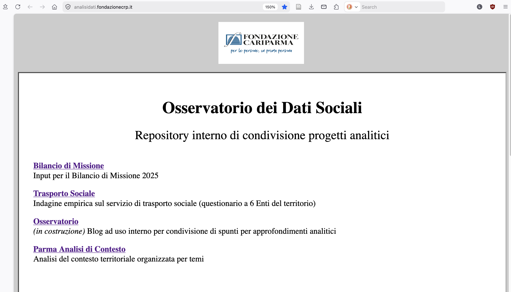

```{r}
#| label: setup
#| include: false

library(here)
library(flextable)

# Font / palette / brdr_in / f_ft_word / theme_survey
source(here("R", "formatting.R"))
# f_ft_slides / f_ft_slides_tight / theme_survey_slides
source(here("R", "slides_formatting.R"))

# Asset delle slide (tutti pre-prodotti da questionario_report/survey_analysis.qmd):
#   - Plot  → PNG in presentazione/assets/plots/   (inclusi con knitr::include_graphics)
#   - Tabelle → .rds in presentazione/assets/tables/ (oggetti flextable)
#
# slide_table(name, tight = FALSE, ...)
# ---------------------------------------
# Helper che fa DUE cose:
#   1. readRDS("presentazione/assets/tables/<name>.rds")  → carica la flextable
#   2. applica lo styling da slide definito in R/slides_formatting.R:
#        - tight = FALSE  → f_ft_slides()         [default, font più grande]
#        - tight = TRUE   → f_ft_slides_tight()   [font più piccolo, per
#                                                  tabelle con molte colonne]
#
# DEFAULT attuali (definiti in R/slides_formatting.R):
#                    f_ft_slides   f_ft_slides_tight
#   font_size        16 pt         13 pt
#   stretch          TRUE          TRUE       (tabella = 100% larghezza slide)
#   max_width        10.5 in       10.5 in    (usato solo se stretch = FALSE)
#   pad              2 pt          1 pt       (padding verticale celle)
#   line_spacing     1             1          (1 = stretto; 1.3–1.5 = arioso)
#   font family      target_font   target_font (da R/formatting.R)
#
# Altezza di una riga ≈ line_spacing × font_size + 2×pad. Per "far respirare"
# una tabella alzare line_spacing ha PIÙ effetto che alzare pad.
#
# OVERRIDE per singola slide: tutto ciò che passi come `...` arriva dritto a
# f_ft_slides / f_ft_slides_tight. Esempi:
#   slide_table("s1-attivita", font_size = 18)                  # più grande
#   slide_table("s6-costo-km", stretch = FALSE, max_width = 7)  # compatta
#   slide_table("s5-flotta", tight = TRUE, font_size = 15)      # tight ma leggibile
#   slide_table("s9-consid-1", line_spacing = 1.4)              # righe arieggiate
#   slide_table("s9-consid-1", pad = 10, line_spacing = 1.3)    # molto arieggiata
slide_table <- function(name, tight = FALSE, ...) {
  ft <- readRDS(here("presentazione", "assets", "tables", paste0(name, ".rds")))
  if (tight) f_ft_slides_tight(ft, ...) else f_ft_slides(ft, ...)
}
```

## Principali responsabilità 

::: {style="font-size: 70%;"}
1. Curare l'==analisi dei fabbisogni del territorio== a supporto documenti di indirizzo (PS pluriennale + DPP)

2. Partecipare alla ==redazione di materiali== per Bilancio di missione e attività della comunicazione 

3. Curare attività ==valutazione in itinere ed ex-post== esiti attività filantropica della Fondazione 

4. Aggiornare su ==produzione scientifica rilevante== e gestire interlocuzioni con studiosi e operatori 

[5.] _Promuovere una cultura dei dati [aperti!] e contribuire all'ottimizzazione dei sistemi informativi_
::: 

## 1. Curare l'`analisi dei fabbisogni del territorio` a supporto documenti di indirizzo

::: {style="font-size: 70%;"}
- Validato gli ==indicatori rilevati da OpenImpact-Sinloc== nella analisi di contesto presentata il [TBD...]{style="background-color: #ffd500; padding: 0 4px;"} 
  - approfondimenti _ad hoc_ (trend demografici, disabilità e non autosufficienza...)

  - condotto indagine empirica sull'offerta di ==trasporto sociale== con interviste mirate a 7 enti


<br>

### **Prossimi passi**:  

  - identificare argomenti specifici su cui focalizzare attenzione [EXE...]{style="background-color: #ffd500; padding: 0 4px;"}
  
  <!-- ES le case di comunità / gli anziani soli e dove sono?  -->
  
- avviare un =="blog" dell'Osservatorio== articolato in rubriche tematiche:
  + `Pillole di dati` — mini visualizzazioni e focus su dati territoriali
  + `Cultura del dato` — metodi e strumenti per analizzare i dati
  + `Interviste` — punti di vista di analisti dei dati sociali
  + `Aggiornamenti` — novità sui dataset monitorati 
  
:::   
  
::: {.notes}
... 
:::
 
## 2. Partecipare alla redazione di materiali per `Bilancio di missione` e attività della `comunicazione`  

::: {style="font-size: 70%;"}
- redatto analisi di contesto per ==Bilancio di missione 2025==
 
<br>

### **Prossimi passi**:  
  - identificare con Area Erogativa focus tematici di anno in anno  [EXE...]{style="background-color: #ffd500; padding: 0 4px;"} 
  - ricognizione sistematica di vari output analitici (e.g. studi, convegni, ecc.):
    - relazioni degli Enti 
    - documenti preliminari degli Advisor [EXE...]{style="background-color: #ffd500; padding: 0 4px;"}
  
  <!-- ES le case di comunità / gli anziani soli e dove sono?  -->

:::  


::: {.notes}
... 
:::
 
## 3. Curare attività `valutazione in itinere ed ex-post` esiti attività filantropica della Fondazione 

::: {style="font-size: 70%;"}
+ Interlocuzioni con ==OpenImpact-Sinloc== e contributi sull'impianto teorico della valutazione
+ Preso in carico  (lato Fondazione) il ==coordinamento== di Evaluation Lab, questionari e _focus group_, e le loro richieste di dati interni 

<!-- 	+ prossimi appuntamenti: 1 focus group sistemi M&E **17 aprile**  +  1 incontro Matteo Garofano AUSL - beneficiari digitali il **24 aprile**  -->
<!-- +  Gestione dell'ultimo Eval lab 5 febbraio -->

<br>

### **Prossimi passi**:  
+ gestire alcune domande sulla valutazione dei Progetti propri (approfondimenti di dati richiesti)
+ validare i risultati ottenuti dai questionari agli enti 
+ fornire feedback lato utente sul loro sistema informativo (`Impact Manager`)  

 

:::

::: {.notes}
```
DONA:
- adesso x4 anni (+2?) quell'impianto Open ce lo teniamo perchè è stato messo nel Piano Strategico ed è lo strumento per comply con impegni presi
- quel lavoro li lo fanno loro xò il tuo è un ruolo di INTERMEDIARIO -- tu devi saperlo usare (essere in grado di gestirlo quel prodotto - se io ti chiedo tirami fuori la valutazione per bando)
- poi è chiaro che loro vogliono venderti un pacchetto e se possibile renderti 
- ❓ potremmo pian piano staccarci e usare un altro sistema...  
```
:::
 
## 4. Monitorare la `produzione scientifica rilevante` e gestire interlocuzioni con studiosi e operatori 
::: {style="font-size: 70%;"}
+ Avviato ==dialogo con enti di ricerca==, Osservatori di altre fondazioni, e operatori rilevanti su:
  + disponibilità/aggiornamento di dati specifici (e.g. R-ER Statistica, AICCON, Secondo Welfare, ... )
  + software e strumenti per la raccolta e l'analisi dei dati per il Terzo Settore (e.g. Techsoup, Posit, LimeSurvey, ...)
  
<br>

### **Prossimi passi**:  

- In dialogo con Donatella, definire meglio output dell'Osservatorio che siano utili e insieme commisurati alle forze:
  - ricerche "in-house" v. commissionate ad altri
- Continuare a presidiare eventi rilevanti e restituire alla struttura spunti utili

:::
::: {.notes}
... 
:::
 
## [5.] _Promuovere una cultura dei dati [aperti!] e contribuire all'ottimizzazione dei sistemi informativi_
::: {style="font-size: 70%;"}
+ Impostati strumenti di lavoro per produrre ==analisi (più possibile) automatizzate, riproducibili== (R, Quarto)
+ Creati mini-siti tematici per la condivisione dei lavori dell'Osservatorio con i colleghi via intranet [https://analisidati.fondazionecrp.it/](https://analisidati.fondazionecrp.it/)^[ Questo link si apre solo dentro il dominio DFCRPR]

<br>

### **Prossimi passi**:  
+ Promuovere una cultura dei dati aperti e accessibili e di metodi di analisi riproducibili
+ Preparare seminari, materiali formativi, e collaborare con UniPR a questo fine
+ Contribuire a vagliare la disponibilità e opportunità di strumenti di IA
:::

::: {.notes}
... 
:::
 
## Per discussione con il CdA

::: {style="font-size: 70%;"}
Da settembre sono state **impostate tutte e 4 (+1) aree di lavoro** dell'Osservatorio, con interlocuzioni attivate verso enti di ricerca, Osservatori di altre fondazioni, fornitori di strumenti, e struttura interna.

<br>

Possibili ambiti di confronto per alcune scelte di ==indirizzo==:

+ **Profondità vs ampiezza** — su quali temi concentrare approfondimenti in-house e quali limitare al monitoraggio
+ **In-house vs commissionato** — quali analisi sostenere con risorse esterne (es. studi tematici, valutazioni dedicate)
+ **Dimensionamento dell'Osservatorio** — come calibrare l'attività rispetto agli obiettivi del Piano Strategico pluriennale

:::


# Allegati


## `"Meta sito"` - condivisione _interna_ di progetti analitici e spunti vari

{width=80%}

::: aside
[Accessibile solo da rete aziendale]
:::

## Quarto - HIDDEN {visibility="hidden"}

- Footnote ^[the footnote text]
- aside
- speakers notes
- [link](https://quarto.org/docs/presentations/revealjs/advanced.html)
- `Sys.time()`

::: aside
Some additional commentary of more peripheral interest.
:::

::: {.notes}
Speaker notes go here.
:::

